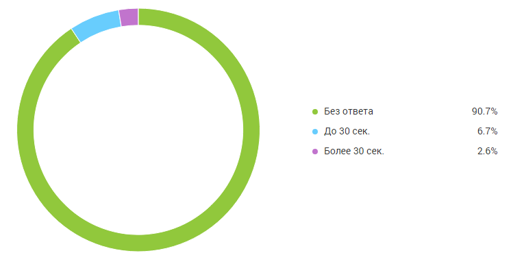
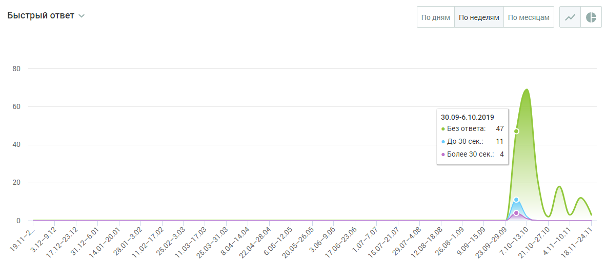

# БЛОК ВИЗУАЛИЗАЦИИ

> Трассировка: PDF §4.5.11.3.3 · сквозные стр. 366-367 · источники: ч.4 `kb/mango-product-docs/sources/mango-lk-manual/LK_manual_v-121часть-4.pdf` с.63-64.

Данные в блоке отображаются в виде графика (по умолчанию) или круговой диаграммы.

Для отчета Быстрые ответы круговая диаграмма содержит следующую информацию: • Процент обращений, оставшихся без ответа; • Процент обращений с быстрым ответом (до 30 секунд); • Процент обращений с медленным ответом (свыше 30 секунд).

Для переключения на график щелкните по иконке в правом верхнем углу окна. График содержит следующую информацию: • на горизонтальной оси - динамика по времени; • на вертикальной оси - количество обращений. При наведении курсора на график отображается подсказка, включающая: • число обращений на выбранную дату; • время реакции на обращения: без ответа, до 30 сек., более 30 сек.

График может отображаться в срезах: по дням, по неделям, по месяцам.

Для переключения на круговую диаграмму щелкните по иконке в правом верхнем углу окна.
