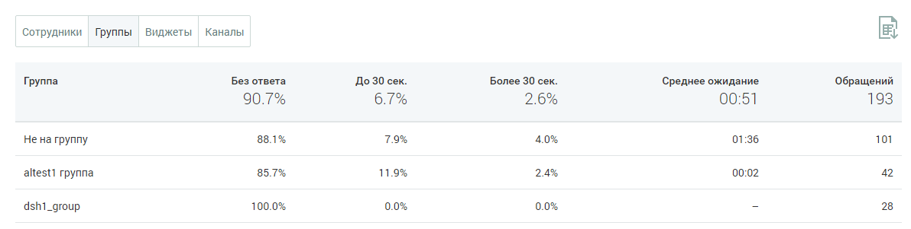

# БЛОК ТАБЛИЦЫ

> Трассировка: PDF §4.5.11.3.3 · сквозные стр. 367-368 · источники: ч.4 `kb/mango-product-docs/sources/mango-lk-manual/LK_manual_v-121часть-4.pdf` с.64-65.

Таблица формируется по срезам: • Сотрудники • Группы • Виджеты • Каналы

Таблица включает следующие данные: • Наименование среза - в данном примере срезом выбрана группа; • Процент обработанных обращений в зависимости от скорости ответа на обращение. Для сортировки данных в таблице щелкните по наименованию столбца.

