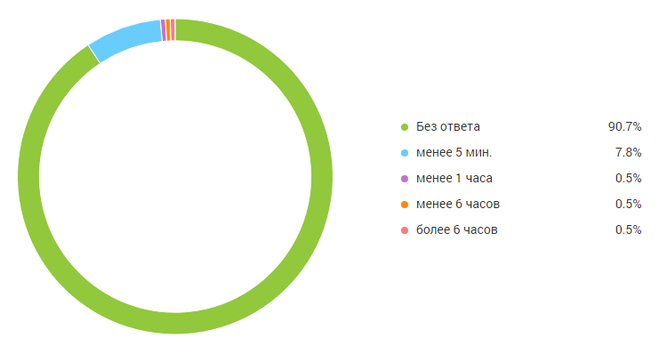
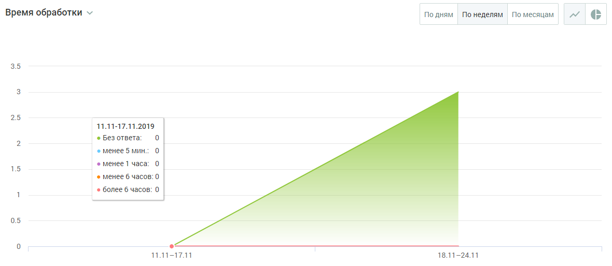

# БЛОК ВИЗУАЛИЗАЦИИ

> Трассировка: PDF §4.5.11.3.4 · сквозные стр. 368-369 · источники: ч.4 `kb/mango-product-docs/sources/mango-lk-manual/LK_manual_v-121часть-4.pdf` с.65-66.

Данные в блоке отображаются в виде графика (по умолчанию) или круговой диаграммы.

Для отчета Время обработки круговая диаграмма содержит следующую информацию: • Процент обращений, оставшихся без ответа; • процент обращений, где время обработки до 5 минут; • процент обращений, где время обработки менее 1 часа (но более 5 минут); • процент обращений, где время обработки менее 6 часов (но более 1 часа); • процент обращений, где время обработки более 6 часов.

Для переключения на график щелкните по иконке в правом верхнем углу окна. График содержит следующую информацию: • на горизонтальной оси - динамика по времени; • на вертикальной оси - количество обращений. При наведении курсора на график отображается подсказка, включающая: • число обращений на выбранную дату; • время реакции на обращения: без ответа, менее 5 минут, менее 1 час, менее 6 часов, более 6 часов.

График может отображаться в срезах: по дням, по неделям, по месяцам.

Для переключения на круговую диаграмму щелкните по иконке в правом верхнем углу окна.
