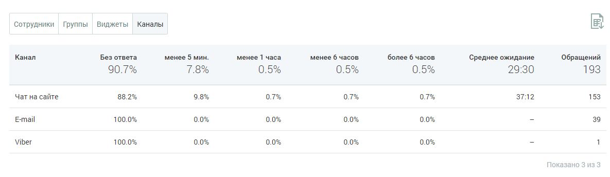

# БЛОК ТАБЛИЦЫ

> Трассировка: PDF §4.5.11.3.4 · сквозные стр. 369-370 · источники: ч.4 `kb/mango-product-docs/sources/mango-lk-manual/LK_manual_v-121часть-4.pdf` с.66-67.

Таблица формируется по срезам: • Сотрудники • Группы • Виджеты • Каналы

Таблица включает следующие данные: • Наименование среза - в данном примере срезом выбран канал; • Процент обработанных обращений в зависимости от времени обработки обращения. Для сортировки данных в таблице щелкните по наименованию столбца.

