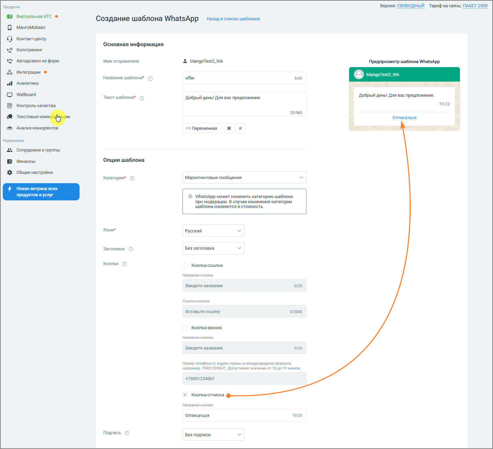
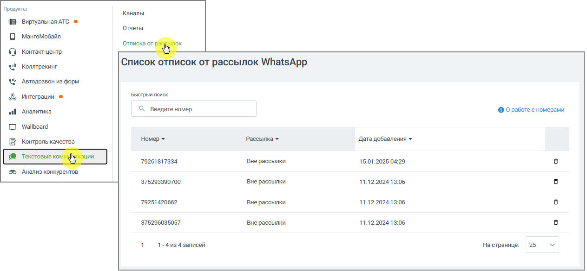
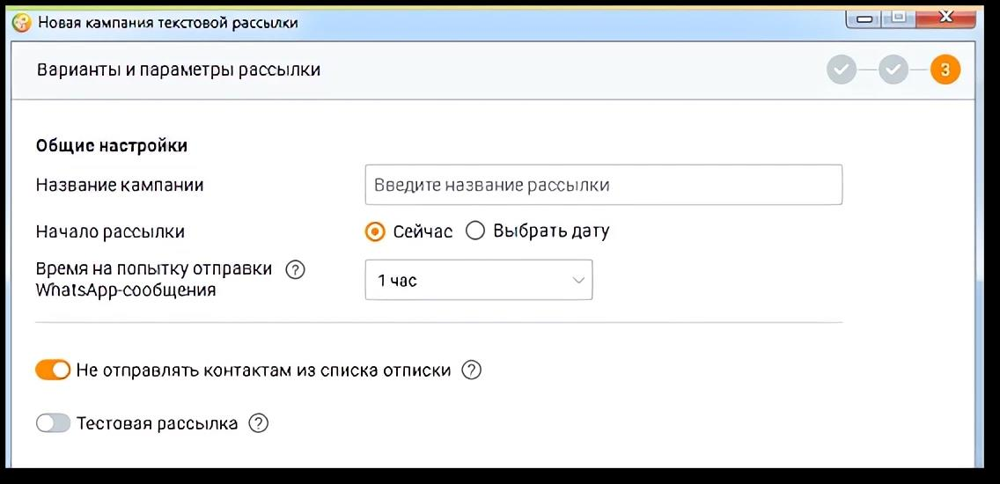

# 4.5.11.4. Отписка от рассылок WhatsApp

> Трассировка: PDF §4.5.11.4 · сквозные стр. 370-373 · источники: ч.4 `kb/mango-product-docs/sources/mango-lk-manual/LK_manual_v-121часть-4.pdf` с.67-70.

Опция «Отписаться» в шаблоне сообщения WhatsApp Business API (WABA) предназначена для автоматизации процесса исключения абонентов из маркетинговых рассылок. Эта функция позволяет абонентам самостоятельно отказаться от дальнейшего получения сообщений компании, что помогает снизить риск блокировки аккаунта WhatsApp (WABA) клиентом и улучшить репутационный рейтинг компании.

Как использовать опцию «Отписаться» 1) Добавление кнопки «Отписаться» в шаблон сообщения: • В Личном кабинете пользователя ВАТС предусмотрена возможность включения кнопки «Отписаться» при создании или редактировании шаблона маркетингового сообщения. • После нажатия на кнопку абонент отправляет автоматическое уведомление об отказе от рассылок.

2) Действия системы после нажатия кнопки «Отписаться»: • Номер абонента автоматически добавляется в «Список отписок от рассылок WhatsApp» компании (раздел ВАТС Текстовые коммуникации → Список отписок).

• Абонент исключается из всех текущих и будущих маркетинговых рассылок WhatsApp. При этом другие способы взаимодействия с абонентом остаются доступными.

3) Управление «Списком отписок от рассылок WhatsApp»: • Операторы могут вручную управлять «Списком отписок от рассылок WhatsApp» в Личном кабинете пользователя ВАТС: o Просматривать номера, попавшие в список после отписки. o Удалять номера абонентов из списка: чтобы удалить номер, нажмите на иконку «корзина» в строке с удаляемым номером. 4) Исключение номеров из кампаний Контакт-центра: • При запуске кампании из Контакт-центра в настройках текстовой рассылки доступна опция «Не отправлять контактам из списка отписки». • При отправке массовой текстовой рассылки для абонентов, чей номер находится в списке отписок, будет указан статус «Не доставлено» и причина «Абонент добавлен в список отписки рассылки».

5) Рекомендации по использованию • Включайте опцию «Отписаться» во все маркетинговые сообщения, чтобы снизить количество жалоб от абонентов. Функционал отписки помогает защитить аккаунт от блокировки, повышает удовлетворённость абонентов и позволяет сосредоточиться на взаимодействии с заинтересованной аудиторией.
