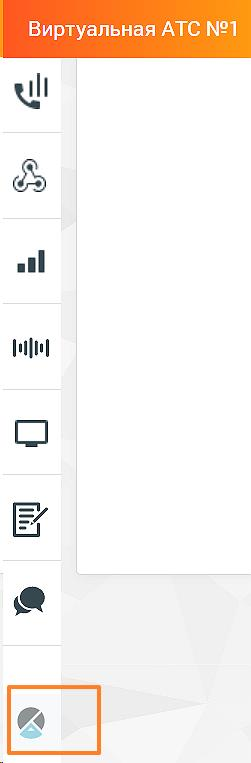

# 4.5.16. Аналитика «Calltouch»

> Трассировка: PDF §4.5.16 · сквозные стр. 392-393 · источники: ч.4 `kb/mango-product-docs/sources/mango-lk-manual/LK_manual_v-121часть-4.pdf` с.89-90.

Иконка меню "Аналитика Calltouch" отображается у пользователей с соответствующими правами доступа.

Клик по иконке открывает страницу авторизации в сервисе "Аналитика Calltouch" Вход в личный кабинет | Calltouch Зарегистрироваться в сервисе можно по ссылке https://www.calltouch.ru/mango/.

