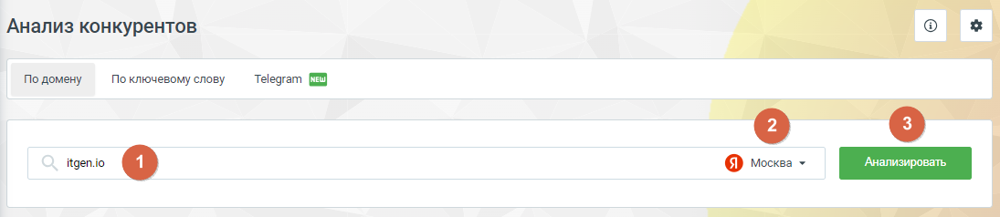

# 4.5.17.1. Анализ по домену

> Трассировка: PDF §4.5.17.1 · сквозные стр. 394-395 · источники: ч.4 `kb/mango-product-docs/sources/mango-lk-manual/LK_manual_v-121часть-4.pdf` с.91-92.

«Анализ по домену» представляет собой инструмент для детального анализа веб- ресурсов на основе их доменных характеристик. Здесь вы сможете получить

информацию о конкурентах, оценить их активность в контексте и органическом поиске, а также сравнить ключевые метрики анализируемого сайта с сайтами конкурентов.

Элементы страницы: 1. Поле ввода анализируемого домена. Введите URL сайта для получения сопоставительной информации по ключевым параметрам. 2. Выбор региона. Эта опция позволяет настроить анализ конкурентов с учетом конкретной географической территории. 3. Кнопка Анализировать – запуск процесса сбора и анализа данных, основанных на введенных параметрах, включая домен, выбранную территорию и др.
