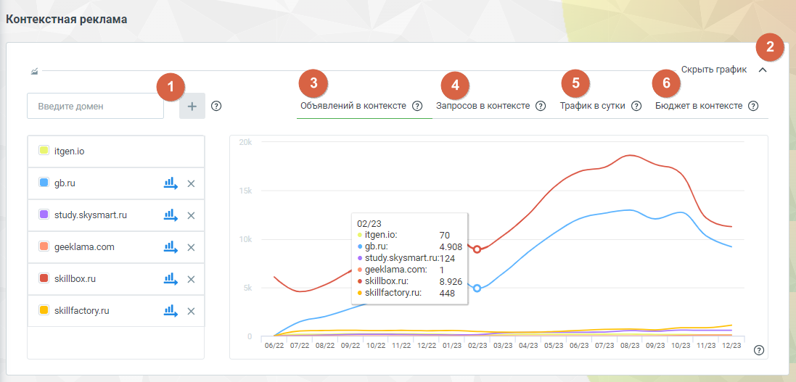
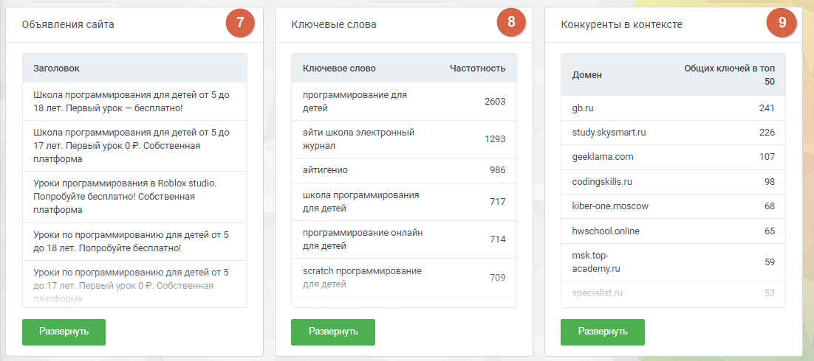
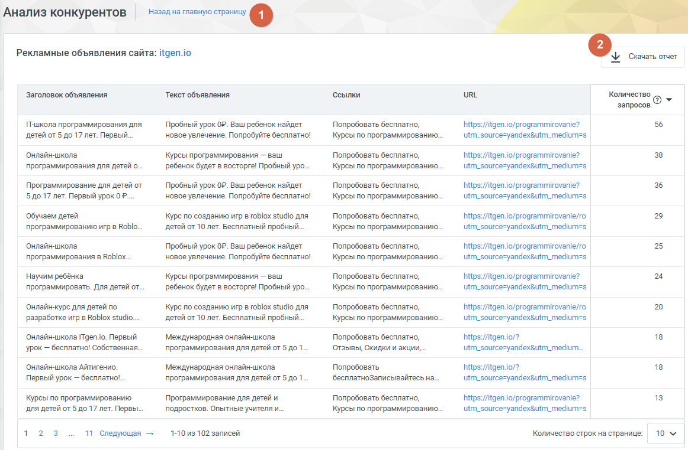
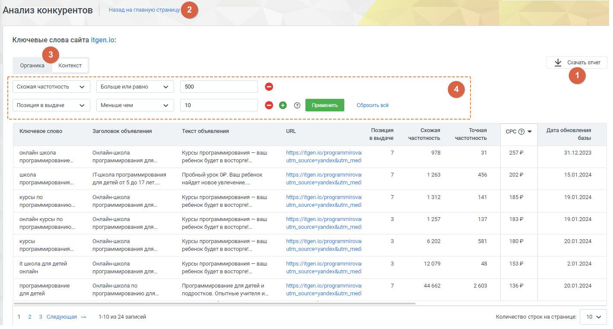
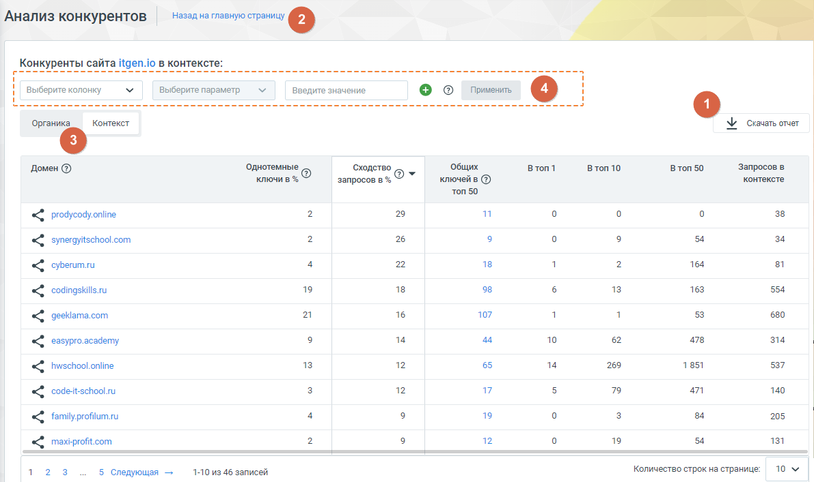
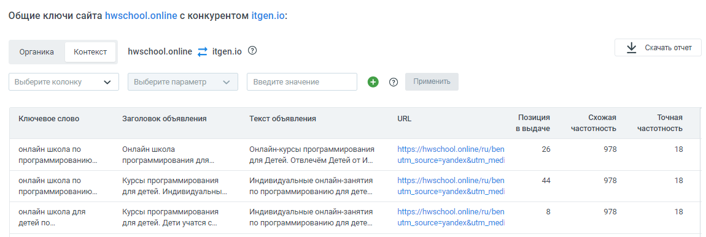

# Блок «Контекстная реклама»

> Трассировка: PDF §4.5.17.1 · сквозные стр. 395-401 · источники: ч.4 `kb/mango-product-docs/sources/mango-lk-manual/LK_manual_v-121часть-4.pdf` с.92-98.

Функционал блока «Контекстная реклама» фокусируется на анализе контекстной рекламной активности конкурентов.

Элементы блока:

1. Добавить домен. Введите несколько доменов для сравнения рекламной активности и стратегий конкурентов. Система предоставит подробные данные об активности на выбранных доменах. 2. Пиктограмма сворачивания/разворачивания – элемент управления, позволяющий скрыть или отобразить график для удобства работы. Щелкните, чтобы уменьшить визуальный объем информации. Графики: 3. Объявлений в контексте – график показывает динамику изменения количества рекламных объявлений конкурента в выбранном периоде времени. 4. Запросы в контексте – информация о том, какие ключевые запросы активируют рекламу конкурента, а также как изменяется их количество со временем. 5. Трафик в сутки – график отражает колебания в объеме посещений сайта конкурента в течение каждого дня, из переходов по контекстной рекламе. 6. Бюджет в контексте – график показывает расходы конкурента на контекстную рекламу, позволяя вам оценить их стратегию и ресурсы.

7. Объявления сайта – подробная информация о рекламных объявлениях конкурентов в Яндекс.Директе. 8. Ключевые слова – информация о ключевых словах, используемых в контекстной рекламе Яндекса на сайтах-конкурентах. 9. Конкуренты в контексте – анализ рекламных объявлений конкурентов в Яндекс.Директе, основанный на ключевых словах, указанных в контекстной рекламе анализируемого домена.

Объявления сайта Этот раздел отчета предоставляет подробную информацию о рекламных объявлениях конкурентов в Яндекс.Директе. Вы сможете не только проанализировать рекламные кампании конкурентов, но и использовать этот отчет для оценки собственного сайта. Нажатие на кнопку Развернуть открывает страницу отчета с детализацией: 1. Кнопка Скачать отчет – нажатие на кнопку загружает отчет о рекламных объявлениях конкурентов в формате CSV. 2. Кнопка Назад на главную страницу – переход пользователя обратно на главную страницу сервиса "Анализ конкурентов".

Предоставляемые данные: • Заголовок объявления: заголовки, которые используют конкуренты в своих рекламных объявлениях. • Текст объявления: текст объявлений в Яндекс.Директе, что помогает в понимании содержания рекламы конкурентов. • Ссылки: быстрые ссылки, добавленные конкурентами в свои объявления, что может дать представление о направлении их трафика. • URL: кликабельная ссылка на посадочные страницы сайта-конкурента, куда направляет объявление.

• Количество запросов: сколько ключевых слов соответствуют данному объявлению конкурента. Ключевые слова Отчет предоставляет информацию о ключевых словах, используемых в контекстной рекламе Яндекса на сайтах конкурентов. Этот отчет полезен как для анализа конкурентов, так и для оптимизации собственных рекламных кампаний. Нажатие на кнопку Развернуть открывает страницу отчета с детализацией:

1. Кнопка Скачать отчет – нажатие на кнопку загружает отчет в формате CSV. 2. Кнопка Назад на главную страницу – переход пользователя обратно на главную страницу сервиса "Анализ конкурентов". 3. Переключатель «Органика/Контекст» – быстрое переключение между анализом ключевых слов сайта в органическом поиске и в контекстной рекламе. 4. Фильтры данных отчета – фильтры для настройки отображения данных отчета согласно предпочтениям пользователя. a. Выберите колонку: выбор конкретной колонки данных, по которым вы хотите применить фильтр. b. Выберите параметр: выбор параметра фильтрации, связанного с выбранной колонкой данных. c. Введите значение: здесь пользователи могут ввести конкретное значение или условие, которое будет использоваться для фильтрации данных в выбранной колонке.

d. Кнопка Применить: нажатие на кнопку запускает процесс применения фильтра, основанного на выбранных параметрах и значениях. e. Пиктограммы добавления и удаления полей: нажмите на плюс (+) для добавления нового фильтрационного поля. Нажмите на минус (-), чтобы удалить соответствующее поле фильтрации. f. Кнопка Сбросить все: нажатие на кнопку очищает поля фильтрации. Предоставляемые данные: • Ключевое слово: конкретные слова или фразы, по которым показываются рекламные объявления в блоке контекстной рекламы Яндекс.Директа. • Заголовок объявления: заголовки рекламных объявлений, связанных с соответствующим ключевым словом. • Текст объявления: тексты рекламных объявлений, что помогает понять, какие креативные элементы используют конкуренты. • URL: ссылка на посадочные страницы, куда направляют рекламные объявления, связанные с определенным ключевым словом. • Позиция в выдаче: на какой позиции в блоке контекстной рекламы расположено объявление для данного ключевого слова. • Схожая частотность: количество упоминаний запроса, включающее его самого и его словоформы. Информация предоставляется на основе данных системы "Wordstat" от Яндекса. • Точная частотность: количество упоминаний запроса в точной форме и порядке слов в запросе, предоставляя точную статистику. • CPC (Средняя цена клика): средняя стоимость клика на рекламное объявление для данного ключевого слова. • Дата обновления базы: дата последнего обновления данных о ключевых словах в отчете. Конкуренты в контексте Отчет "Конкуренты в контексте" предоставляет анализ рекламных объявлений конкурентов в Яндекс.Директе, основанный на ключевых словах, указанных в контекстной рекламе анализируемого домена. Нажатие на кнопку Развернуть открывает страницу отчета с детализацией: 1. Кнопка Скачать отчет – нажатие на кнопку загружает отчет в формате CSV. 2. Кнопка Назад на главную страницу – переход пользователя обратно на главную страницу сервиса "Анализ конкурентов". 3. Переключатель «Органика/Контекст» – быстрое переключение между анализом ключевых слов сайта в органическом поиске и в контекстной рекламе. 4. Фильтры данных отчета – фильтры для настройки отображения данных отчета согласно предпочтениям пользователя.

a. Выберите колонку: выбор конкретной колонки данных, по которым вы хотите применить фильтр. b. Выберите параметр: выбор параметра фильтрации, связанного с выбранной колонкой данных. c. Введите значение: здесь пользователи могут ввести конкретное значение или условие, которое будет использоваться для фильтрации данных в выбранной колонке. d. Кнопка Применить: нажатие на кнопку запускает процесс применения фильтра, основанного на выбранных параметрах и значениях. e. Пиктограммы добавления и удаления полей: нажмите на плюс (+) для добавления нового фильтрационного поля. Нажмите на минус (-), чтобы удалить соответствующее поле фильтрации. f. Кнопка Сбросить все: нажатие на кнопку очищает поля фильтрации.

Предоставляемые данные: • Домен: список предполагаемых конкурентов анализируемого сайта. Кликнув по наименованию домена, можно перейти на сайт конкурента, либо запустить новый анализ - данного домена. • Однотемные ключи в %: процент ключевых слов анализируемого сайта, совпадающих с ключевыми словами конкурентов в контексте.

• Сходство запросов в %: процент запросов, по которым найдены сайты предполагаемых конкурентов, относительно общего количества запросов анализируемого сайта. • В топ 1, В топ 10, В топ 50: количество ключевых слов сайта-конкурента в топ 1, 10 и 50 выдачи Яндекса. • Запросов в контексте: количество ключевых слов, по которым контекстные объявления сайта-конкурента отображаются в выдаче Яндекса. • Общих ключей в топ 50: количество общих ключевых слов в контекстной рекламе анализируемого сайта и конкурента в топ 50 выдачи Яндекса. Клик по числу открывает список общих ключевых слов, с возможностью фильтрации.

