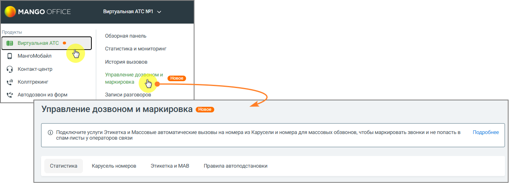

# 4.5.18. Управление дозвоном и маркировка

> Трассировка: PDF §4.5.18 · сквозные стр. 408-409 · источники: ч.5 `kb/mango-product-docs/sources/mango-lk-manual/LK_manual_v-121часть-5.pdf` с.4-5.

Раздел отображается в меню, если для текущего продукта доступна хотя бы одна из его вкладок: Статистика, Карусель номеров, Этикетка и МАВ, Правила автоподстановки. Раздел отображается в соответствии с условиями отображения каждой вкладки.

