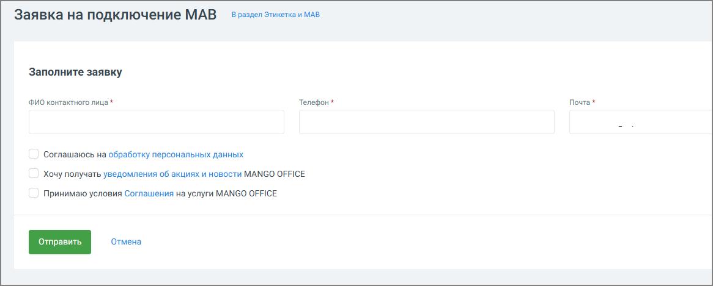

# 4.5.18.3.2. МАВ

> Трассировка: PDF §4.5.18.3.2 · сквозные стр. 419-421 · источники: ч.5 `kb/mango-product-docs/sources/mango-lk-manual/LK_manual_v-121часть-5.pdf` с.15-17.

МАВ — это услуга, которая позволяет компании выполнять массовые или автоматические телефонные звонки. Подключение услуги необходимо для: • использования систем автоматического обзвона; • массовых уведомлений клиентов; • регистрации компании в реестре инициаторов массовых вызовов.

Услугу МАВ необходимо подключить, если компания: • выполняет массовые обзвоны клиентов; • использует системы автодозвона; • выполняет автоматические или роботизированные звонки. Подключение МАВ позволяет исключить возможные блокировки звонков со стороны операторов связи. совет Подключайте услугу МАВ после подключенной услуги «Этикетка». Если Этикетка не подключена, система предложит сначала оформить заявку на её подключение. Подключение МАВ Нажмите Отправить заявку в блоке «МАВ». Заполните доступные поля формы: укажите ФИО, контактный телефон или e-mail и подтвердите согласие на обработку персональных данных.

После успешной отправки заявки в личном кабинете появится уведомление: «Вы отправили заявку на подключение МАВ». Далее выполняются следующие действия: 1. Заявка передается персональному менеджеру. 2. Проводится проверка данных компании. 3. Номера компании регистрируются в реестре инициаторов массовых вызовов. 4. После завершения процедуры услуга становится активной. Подключение услуги выполняется после проверки данных и регистрации у операторов связи. Срок подключения зависит от:

• количества номеров; • операторов связи; • корректности данных компании. внимание Подключение услуги МАВ предоставляет техническую возможность совершать массовые звонки, но не отменяет требований законодательства. Компания обязана: • получить согласие абонента на получение массовых звонков; • соблюдать требования законодательства о рекламе и персональных данных.
