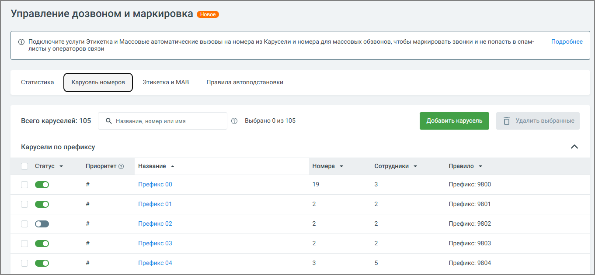

# 4.5.19. Карусель номеров

> Трассировка: PDF §4.5.19 · сквозные стр. 421-423 · источники: ч.5 `kb/mango-product-docs/sources/mango-lk-manual/LK_manual_v-121часть-5.pdf` с.17-19.

Карусель номеров — это инструмент Виртуальной АТС, который автоматически меняет номер при каждом исходящем звонке. Такой механизм помогает снизить вероятность попадания в нежелательные списки и особенно полезен для сотрудников, выполняющих большое количество звонков. Он повышает эффективность дозвона и уменьшает риск блокировки номеров.

Основные задачи: ● возможность параллельного ведения нескольких кампаний с разными номерами; ● обеспечение стабильного дозвона и улучшение обслуживания клиентов; ● имитация локального присутствия в разных регионах.

Использование карусели номеров позволяет решить ряд практических задач, актуальных для бизнеса: ● Снижение риска блокировок при массовых обзвонах - за счёт чередования номеров. ● Распределение нагрузки между несколькими номерами. ● Гибкое управление проектами - каждый сотрудник работает со своим набором номеров. ● Локализация звонков - можно создавать отдельные карусели под разные регионы, чтобы звонки клиентам выполнялись с номеров, относящихся к нужному региону или выбранных пользователем. При этом номера в карусели не обязаны принадлежать конкретному региону - можно использовать любые региональные номера, которые клиент посчитает подходящими. Это повышает вероятность ответа. ● Автоматизация процессов - система автоматически выбирает подходящую карусель на основе заданных правил, а номера внутри карусели используются поочерёдно. При этом может быть создано и запущено несколько одновременных каруселей, что обеспечивает автоматизацию. Таким образом, включение карусели помогает не только оптимизировать внутренние процессы, но и повысить эффективность внешней коммуникации. внимание Карусель имеет приоритет над обычными правилами автоподстановки и действует при наличии подключенной услуги «Карусель номеров». При необходимости можно одновременно использовать карусель номеров и правила автоподстановки. При этом приоритет всегда остаётся за каруселью. Для использования функционала необходимо перейти в Управление дозвоном и маркировка → Карусель номеров. Услугу можно подключить сразу при создании первой карусели. Услуга «Карусель номеров» доступна в рамках версий ВАТС «Максимальная» и «Корпорация». Подключение услуги «Карусель номеров» Перед созданием первой карусели нужно подключить услугу: 1. Перейдите в раздел Управление дозвоном и маркировка → Карусель номеров. 2. Нажмите Подключить карусель. 3. Ознакомьтесь с условиями в открывшемся окне: при использовании карусели номеров к стоимости исходящего звонка по тарифу добавляется 0,49 руб./мин. 4. Нажмите Подключить. При успешной активации появится уведомление об успешном подключении услуги. После этого откроется форма создания первой карусели.

