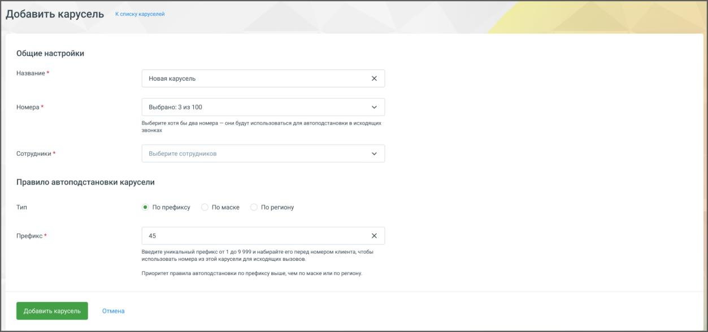

# 4.5.19.2. Создание карусели

> Трассировка: PDF §4.5.19.2 · сквозные стр. 423-424 · источники: ч.5 `kb/mango-product-docs/sources/mango-lk-manual/LK_manual_v-121часть-5.pdf` с.19-20.

После подключения услуги можно создать карусель: 1. Нажмите кнопку Добавить карусель.

2. В открывшейся странице укажите параметры: o Название (до 64 символов), o Номера (для повышения эффективности работы карусели рекомендуется добавить 10-20 номеров, но не менее двух. - DID, DEF, МангоМобайл, SIP Trunk), o Сотрудники (до 500), o Правило автоподстановки: ▪ по префиксу (например, «45»), ▪ по маске (например, 7495\d*),

▪ по региону (например, «Москва»). 3. Нажмите кнопку Добавить карусель. Созданная карусель появится в списке и будет активна (переключатель состояния карусели находится в положении «включен»). Подробнее о том, как работает логика маршрутизации звонков, узнайте далее.
