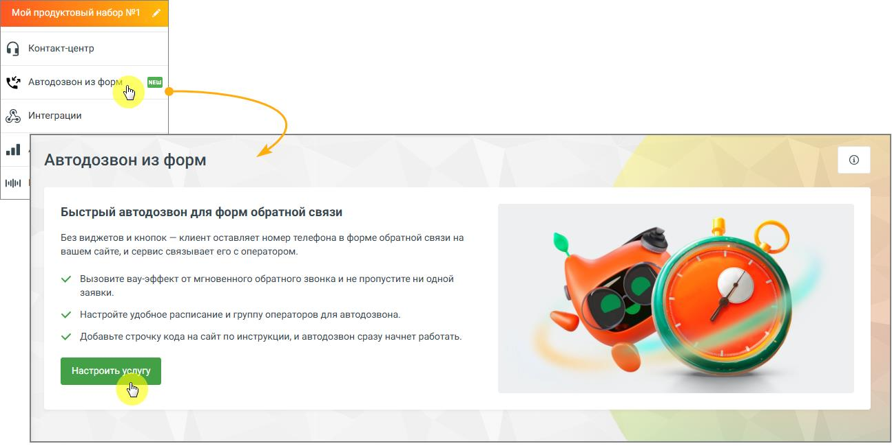
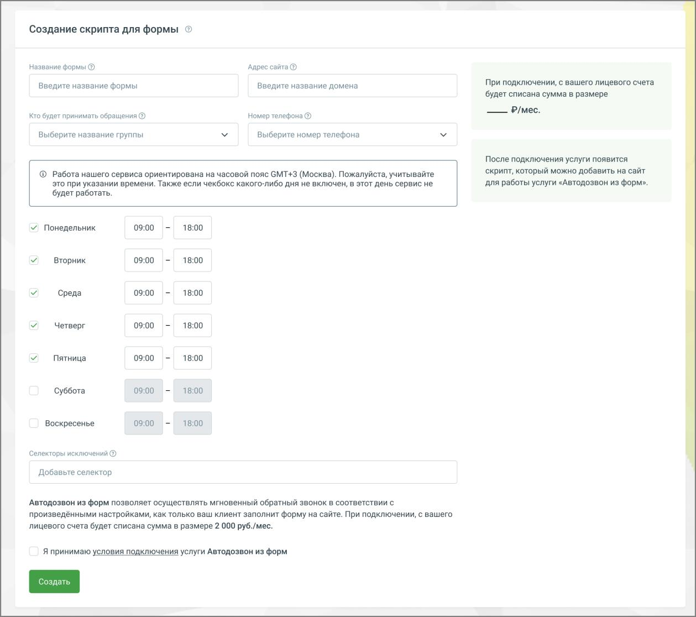
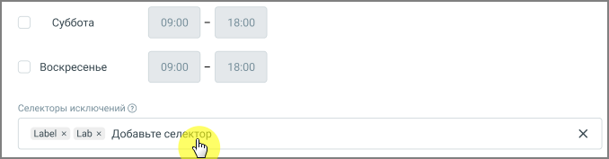
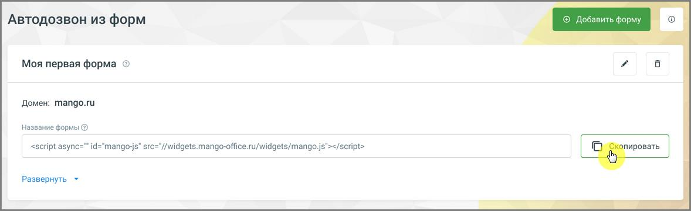

# 4.5.20. Автодозвон из форм

> Трассировка: PDF §4.5.20 · сквозные стр. 435-439 · источники: ч.5 `kb/mango-product-docs/sources/mango-lk-manual/LK_manual_v-121часть-5.pdf` с.31-35.

Автодозвон из форм – услуга, которая автоматически обрабатывает заявки, отправленные через формы обратной связи на вашем сайте, и организует обратный звонок в рабочее время: сначала – на оператора, затем – на номер телефона посетителя сайта для быстрого соединения. Услуга реализуется в виде однострочного кода, который добавляется в код вашего сайта и не отображается посетителям. Основные возможности Услуга «Автодозвон из форм»: • интегрирует обратный звонок без изменения внешнего вида сайта; • автоматически собирает заявки из форм обратной связи, где указан номер телефона; • обеспечивает мгновенный перезвон после отправки формы; • не требует виджетов и кнопок на сайте – добавляется одна строка кода; • работает с любыми формами обратной связи на сайте. Условия подключения • Услуга доступна для подключения в Личном кабинете MANGO OFFICE. • Для работы услуги требуется подключённая и используемая Виртуальная АТС MANGO OFFICE. • Другие продукты для работы услуги не обязательны.

внимание Стоимость услуги не включает тарифы и услуги ВАТС. После нажатия кнопки Настроить услугу открывается страница создания сценария (скрипта).

Создание сценария

На странице «Создание скрипта для формы» заполните параметры: 1. Название форм. Укажите удобное название, чтобы различать сценарии, если их несколько. 2. Адрес сайта. Укажите домен сайта, на котором будет работать автодозвон. 3. Кто будет принимать обращения. Выберите группу операторов. Список групп подгружается из настроек ВАТС. 4. Номер телефона. Выберите номер, на который будут поступать обращения. Список номеров подгружается из ВАТС. 5. Расписание работы. Укажите дни недели и время работы автодозвона. По умолчанию установлен интервал 09:00–18:00. На странице указано, что сервис ориентирован на часовой пояс GMT+3 (Москва). Если чекбокс дня не включён, в этот день сервис работать не будет. Если заявка поступила в

нерабочее время, звонок будет выполнен при начале следующего рабочего периода. 6. Селекторы исключений. При необходимости добавьте селекторы, которые должны быть исключены из обработки. Селектор используется для указания формы или её элемента (например, кнопки отправки), по которому система определяет, какую заявку необходимо обрабатывать. Узнайте больше о том, как на сайте найти селектор кнопки или поля.

После заполнения: • установите флаг «Я принимаю условия подключения услуги «Автодозвон из форм». • нажмите кнопку Создать. Получение и размещение кода на сайте После создания сценария на странице отображается сгенерированный код подключения. (По умолчанию код отображается в свернутом виде. Чтобы просмотреть код полностью, нажмите ссылку Развернуть под полем с кодом). 1. Нажмите кнопку Скопировать, чтобы скопировать код. 2. Разместите код в коде вашего сайта: • на одной странице – если автодозвон должен работать только для формы на этой странице; • на всех страницах сайта – если автодозвон должен работать для форм по всему сайту.

Редактирование формы 1. В списке форм нажмите «карандаш» на нужной форме. 2. Внесите изменения и нажмите «Сохранить». внимание Если изменения в настройках ВАТС влияют на сценарий, это будет отмечено в списке - при раскрытии сценария проблемное поле выделяется красным. Добавление формы 1. Нажмите Добавить форму. 2. Заполните поля, примите условия и нажмите Сохранить. Добавленные формы доступны для «Скопировать», редактирования («карандаш») и удаления («корзина»). Удаление формы Нажмите иконку «корзина» на карточке формы и подтвердите удаление – форма исчезнет из списка. Отключение услуги Если вы хотите отключить услугу, это можно сделать самостоятельно в Личном кабинете, используя одну из доступных кнопок управления услугой.
