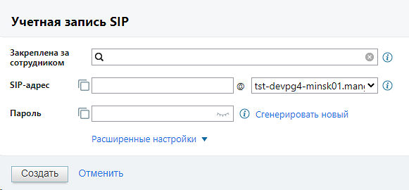
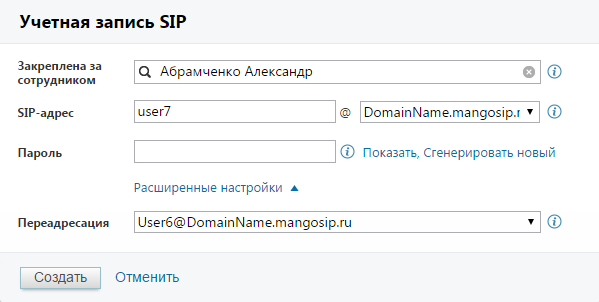
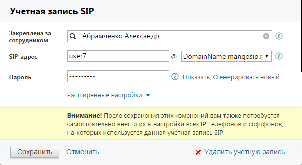
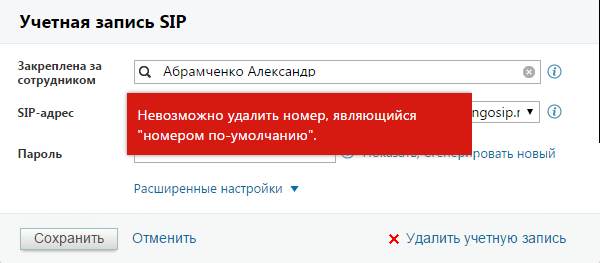

# 4.6.1.1.2. Учетные записи SIP

> Трассировка: PDF §4.6.1.1.2 · сквозные стр. 444-448 · источники: ч.5 `kb/mango-product-docs/sources/mango-lk-manual/LK_manual_v-121часть-5.pdf` с.40-44.

Создание Для создания новой учетной записи SIP нажмите кнопку «Создать учетную запись SIP». На экране будет отображена форма по созданию новой учетной записи SIP. Пример приведен на рисунке ниже.

В поле «Закреплена за сотрудником» при помощи контекстного поиска указывается существующий сотрудник, за которым будет закреплена новая учетная запись. совет Если поиск не обнаружил сотрудника с таким именем, то после нажатия Создать будет создан новый сотрудник. При создании наименования в поле «SIP-адрес» соблюдайте следующие правила: первый символ должен быть буквой латинского алфавита. Минимальное количество символов - четыре. Это могут быть буквы латинского алфавита, цифры и символы. Если вы хотите, чтобы наименование состояло только из цифр, то оно должно начинаться с «000». Регистр не учитывается. При создании пароля следует соблюдать следующие правила: пароль в обязательном порядке должен включать цифры, строчные и прописные буквы. Минимальное количество символов - восемь. При нажатии «Сгенерировать новый» выполняется автоматическое создание «случайного» пароля, удовлетворяющего этим условиям. При нажатии на «Расширенные настройки» форма создания учетной записи SIP принимает вид, как указано на рисунке ниже:

В поле «Переадресация» при необходимости следует указать учетную запись SIP сотрудника, на которого будет переадресован входящий вызов. После того, как все поля заполнены, нажмите «Создать». Если при заполнении полей была допущена ошибка, то на экране будет отображено соответствующее сообщение. Если все данные указаны верно, будет создана новая учетная запись SIP. Созданная учетная запись SIP автоматически указывается в качестве активного и основного средства связи сотрудника. Редактирование Для редактирования учетной записи SIP нажмите на наименование учетной записи SIP в колонке «SIP-адрес». В открывшейся форме введите новые данные, следуя вышеуказанным правилам. Вид формы приведен на рисунке ниже. При редактировании параметров учетной записи, которые указаны в настройках оборудования (Логин, Домен, Пароль), на форме отображается дополнительное сообщение, напоминающее о необходимости внесения изменений.

Если редактируемая учетная запись SIP указана в качестве основного способа связи, то изменение сотрудника, за которым она закреплена, запрещено. Удаление Удаление учетной записи SIP возможно как из формы редактирования, так и из карточки сотрудника. Если данная учетная запись SIP указана в качестве основного способа связи, на экране будет отображено соответствующее сообщение и удаление не будет выполнено. Пример сообщения приведен на рисунке на следующей странице.

Для удаления такой учетной записи SIP необходимо открыть карточку сотрудника на вкладке «Телефония» и указать другой основной способ связи, либо снять флаг в колонке «Активен» напротив наименования учетной записи.

