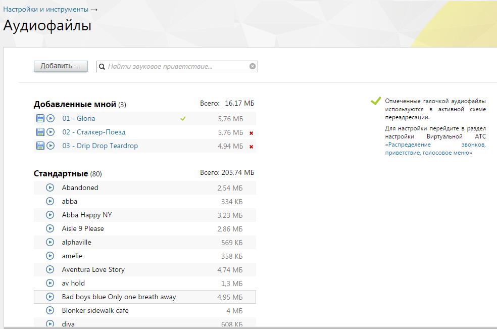
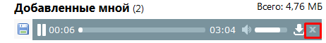

# 4.6.2. Аудиофайлы

> Трассировка: PDF §4.6.2 · сквозные стр. 452-454 · источники: ч.5 `kb/mango-product-docs/sources/mango-lk-manual/LK_manual_v-121часть-5.pdf` с.48-50.

В разделе «Аудиофайлы» можно загрузить готовый или записать новый звуковой фрагмент, а также прослушать уже имеющиеся аудиозаписи.

совет Для создания и поддержания благоприятного имиджа компании можно заказать профессиональную студийную запись приветствий в голосовом меню, рекламных сообщений и мелодий, которые проигрываются позвонившим вам. Обращайтесь в «Манго Телеком» — 8 800 555-55-22. В блоке «Добавленные мной» отображаются загруженные вами аудиофайлы. В заголовке указывается их количество и объем, занимаемый в облачном хранилище. Если звуковые записи используются в Автосекретаре или иной активной схеме переадресации, то они помечаются галочкой и защищены от удаления (в противном случае рядом с ними находится крестик, позволяющий их стереть).

1. В блоке «Стандартные» содержатся аудиофайлы, бесплатно предоставленные «Манго Телеком». Их количество и объем также

указаны, но места в вашем облачном хранилище они не занимают, и их нельзя переименовать, скачать и удалить. Загрузка нового аудиофайла Для загрузки готового или записи нового аудиофайла кликните по кнопке «Добавить». Откроется форма, в которой следует выбрать нужный способ. При загрузке готового звукового приветствия укажите одно из них в системном диалоговом окне. Выбранная запись закачивается на сервер MANGO OFFICE, где производится проверка на допустимость ее формата (по расширению файла). Если верификация пройдена, то соответствующее приветствие добавляется в список и отображается в блоке «Добавленные мной». Если формат не поддерживается, то выводится сообщение об ошибке. Перекодируйте аудиофайл в один из поддерживаемых форматов (MP3 до 256 кбит/с или PCM 8 кГц, 16 бит, моно) и повторите процедуру добавления. Если превышен максимальный допустимый размер аудиофайла (20 Мб), то отображается сообщение об ошибке. Для создания нового звукового приветствия нажмите «Записать самостоятельно». Если у вас есть микрофон и установлен Adobe Flash Player, то в открывшейся форме будет отображаться кнопка «Начать запись». При необходимости нажмите «Разрешить», чтобы Adobe Flash Player получил доступ к микрофону. Если же хоть одно из условий (наличие микрофона и установленной программы) не выполнено, вы увидите рекомендацию по дальнейшим действиям. Максимальная допустимая продолжительность создаваемого звукового приветствия — 2 минуты. После окончания записи нажмите кнопку «Сохранить», и аудиофайл появится в блоке «Добавленные мной». Названия приветствий из этого блока можно поменять, для этого достаточно кликнуть по имени и ввести новое. При загрузке нового аудиофайла или самостоятельной записи сохраняется информация о пользователе, загрузившим файл/запись, а также дата и время загрузки. Прослушивание и скачивание аудиофайлов Все аудиофайлы можно прослушать, нажав соответствующую иконку. Для перехода к другим записям следует закрыть форму плеера, кликнув по крестику (см. рисунок ниже).

Также записи из этого блока можно скачать на компьютер, нажав соответствующую иконку.

Права пользователей раздела «Аудиофайлы» В разделе для стандартных ролей установлено право «Добавлять, просматривать и удалять аудиофайлы»: • только свои аудиофайлы – сотрудник, старший сотрудник, бухгалтер, маркетолог; • аудиофайлы свои и подконтрольных групп – руководитель группы; • любые аудиофайлы – руководитель компании, администратор. ВНИМАНИЕ: Если согласно настроек пользовательских ролей у пользователя имеется полный доступ в раздел "Аудиофайлы", то для него действует право доступа "любые аудиофайлы".
