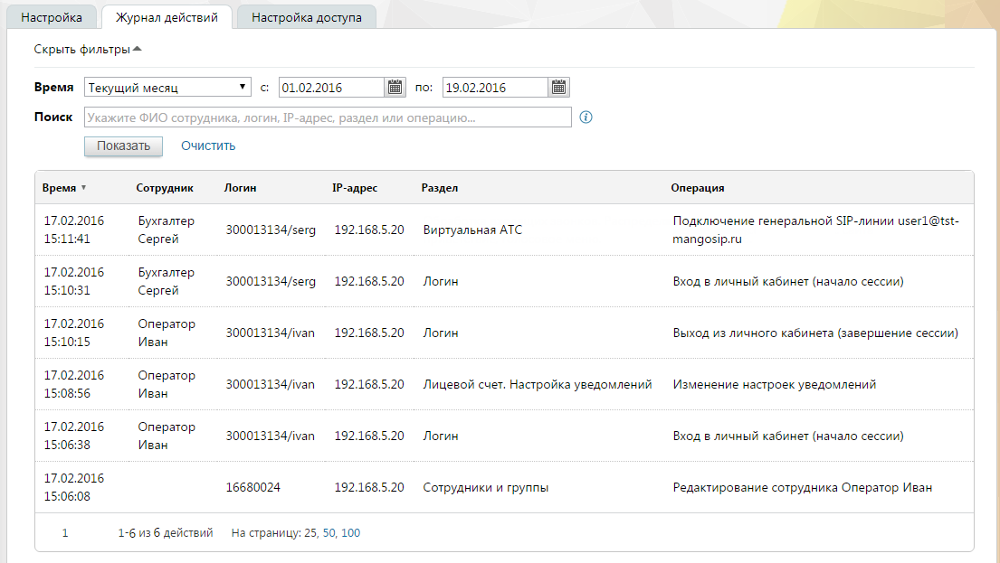

# 4.6.3.2. Журнал действий

> Трассировка: PDF §4.6.3.2 · сквозные стр. 458-459 · источники: ч.5 `kb/mango-product-docs/sources/mango-lk-manual/LK_manual_v-121часть-5.pdf` с.54-55.

Данный отчет отображает информацию о действиях пользователей в Личном кабинете. внимание Отчет «Журнал действий» доступен администратору лицевого счета и пользователям с правом доступа «Администратор». Отчет формируется по указанному периоду. Выберите период или укажите его самостоятельно в полях «с» и «по». При необходимости заполните поле «Поиск». Допускается поиск по: • ФИО сотрудника; • логину вида xxxxxxxxx/name, где: o xxxxxxxxx - цифровой идентификатор Виртуальной АТС; o name – логин пользователя; • IP-адресу; • названию раздела; • названию выполненной операции.

внимание Поиск осуществляется по точному совпадению указанных данных. Обращайте внимание на последовательность слов в запросе. Для формирования отчета нажмите Показать. Пример отчета приведен на рисунке ниже.

Некоторые действия могут выполняться не сотрудником, а системой (например, отправка письма либо уведомления). В отчете такие действия помечаются как выполненные псевдо-пользователем «Система».
