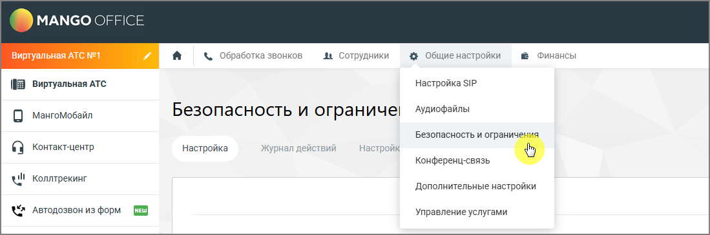

# 4.6.3.3.1. Просмотр списка ролей

> Трассировка: PDF §4.6.3.3.1 · сквозные стр. 460-461 · источники: ч.5 `kb/mango-product-docs/sources/mango-lk-manual/LK_manual_v-121часть-5.pdf` с.56-57.

Список ролей отображается на странице управления ролями.

Рисунок 1. Выпадающий список раздела «Общие настройки» В списке отображаются все роли, доступные в системе. Для каждой роли отображается её название и доступные действия. При выборе роли можно: • просмотреть права доступа роли • изменить права доступа • создать новую роль • удалить роль.

