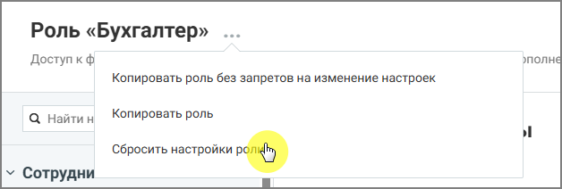

# 4.6.3.3.5. Сбросить настройки роли

> Трассировка: PDF §4.6.3.3.5 · сквозные стр. 465-466 · источники: ч.5 `kb/mango-product-docs/sources/mango-lk-manual/LK_manual_v-121часть-5.pdf` с.61-62.

Если права доступа роли были изменены, их можно вернуть к исходным значениям. При выполнении этой операции все изменённые права доступа будут сброшены, и роль вернётся к стандартному набору прав. Чтобы выполнить сброс: • откройте список ролей • выберите нужную роль

• нажмите иконку контекстного меню и в выпадающем окне выберите вариант «Сбросить настройки роли» • подтвердите действие

Рисунок 7. Сбрасывание настроек роли
