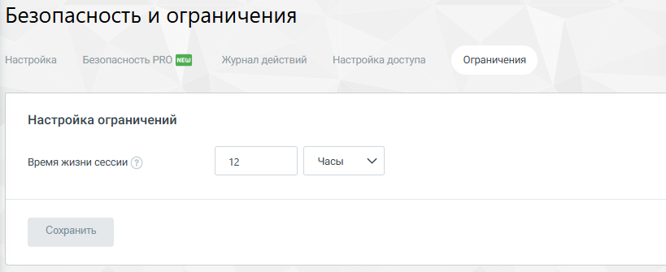

# 4.6.3.4. Ограничения

> Трассировка: PDF §4.6.3.4 · сквозные стр. 472 · источники: ч.5 `kb/mango-product-docs/sources/mango-lk-manual/LK_manual_v-121часть-5.pdf` с.68.

На вкладке "Ограничения" пользователь может управлять временем жизни сессии в рамках системы. Эта настройка определяет, сколько времени сессия пользователя останется активной до автоматического выхода из системы по истечению указанного периода. Такая функция важна для обеспечения безопасности.

Время жизни сессии может быть настроено с минимальным интервалом в 5 минут и максимальным в 365 дней. После задания необходимого интервала времени, необходимо сохранить изменения, нажав кнопку "Сохранить".
