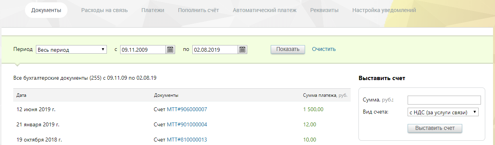

# 2.1.1. Просмотреть/загрузить бухгалтерские документы

> Трассировка: PDF §2.1.1 · сквозные стр. 27-28 · источники: ч.1 `kb/mango-product-docs/sources/mango-lk-manual/LK_manual_v-121часть-1.pdf` с.27-28.

Список «Период» позволяет установить вариант выбора дат (по умолчанию предлагается период «Произвольный»), нажав значок календаря, или ввести их в формате дд.мм.гггг в соответствующие поля. Кнопка «Очистить» возвращает к значению по умолчанию. Кликнув по кнопке «Показать», вы загрузите бухгалтерские документы за указанный календарный период. Нажмите на название любого из них, и появится стандартное диалоговое окно браузера, позволяющее открыть или сохранить файл. При наличии в инвойсах признака «Работать по УПД» (или «Формировать по форме УПД») в таблице отображаются Универсальные передаточные документы (УПД). Для получения более подробной информации об УПД щелкните ссылку «Что такое УПД и как с ним работать».

