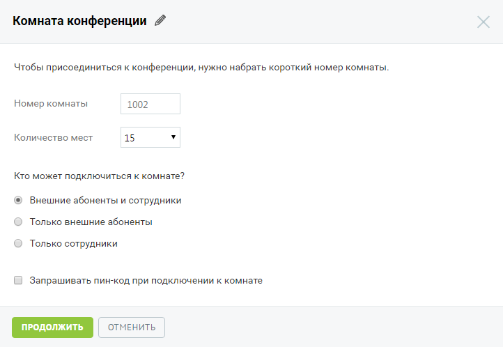
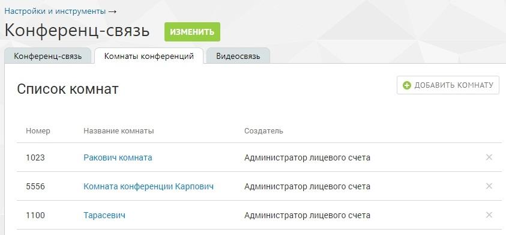

# 4.6.4.2. Комнаты конференций

> Трассировка: PDF §4.6.4.2 · сквозные стр. 477-479 · источники: ч.5 `kb/mango-product-docs/sources/mango-lk-manual/LK_manual_v-121часть-5.pdf` с.73-75.

Услуга «Виртуальные комнаты конференций» позволяет организовать одновременное общение нескольких абонентов в рамках виртуальных комнат. Доступ к каждой комнате «комнату» осуществляется по уникальному внутреннему телефонному номеру. совет Предусмотрена возможность доступа к виртуальным комнатам для сотрудников (не администраторов). Доступ устанавливается в разделе «Безопасность и ограничения» на закладке «Настройки». Для подключения услуги следует выбрать подходящий тариф, согласиться с условиями путем установки флага «Я принимаю условия подключения» и нажать кнопку Подключить. Для изменения пакета услуг следует нажать кнопку Изменить и выбрать новый пакет. В случае, когда количество созданных виртуальных комнат превышает допустимое в новом пакете, необходимо удалить лишние комнаты. Также предусмотрена возможность подключения дополнительного пакета «50х50» (50 комнат на 50 мест). Для подключения пакета следует обратиться к менеджеру компании. Создание новой комнаты выполняется при нажатии кнопки Добавить комнату.

По умолчанию наименованием комнаты является «Комната конференции» и

порядковый номер. Для редактирования наименования нажмите . Введите новое имя

и нажмите . Далее следует указать: • Номер комнаты – внутренний номер для дозвона в комнату. Значение в поле указывается автоматически, начиная с 1000. Если такой номер занят, в поле подставляется следующий по порядку свободный номер. Каждой комнате следует присвоить уникальный номер. По своему функционалу номер комнаты соответствует короткому номеру сотрудника или группы. Таким образом, предусмотрена возможность его использования во всех случаях, когда можно использовать короткий номер (при переводе вызова с клавиатуры телефона, переадресации на номер из схемы распределения звонков, донабора короткого номера в схеме распределения звонков и т.д.). • Количество мест – количество пользователей, которые могут подключиться к комнате одновременно. При выборе большего количества мест, чем предусмотрено текущим пакетом, на экране будет отображено сообщение с предложением подключить пакет, который содержит необходимое количество комнат. Далее следует указать, кто из пользователей может подключиться к данной комнате:

• Внешние абоненты и сотрудники – к комнате могут подключиться как абоненты ВАТС, так и внешние абоненты; • Только внешние абоненты – подключиться к комнате могут только внешние абоненты. Для этого пользователю следует позвонить на номер ВАТС с настроенной схемой распределения звонков, допускающей ввод коротких номеров. В случае, когда к комнате с такой настройкой попытается присоединиться внутренний абонент, он услышит сообщение о невозможности присоединения к комнате с последующим обрывом соединения. • Только сотрудники – подключиться к комнате могут только сотрудники ВАТС. В случае, когда к комнате с такой настройкой попытается присоединиться внешний абонент, он услышит сообщение о невозможности присоединения к комнате с последующим обрывом соединения. Предусмотрена возможность ограничения доступа к комнате при помощи пин-кода. Для этого следует установить флаг «Запрашивать пин-код при подключении к комнате». После установки флага следует задать пин-код, состоящий из набора цифр (от 4 до 7 цифр) и указать далее, кто из пользователей должен вводить пин-код: все пользователи или только внешние абоненты. Для сохранения внесенных изменений необходимо нажать Продолжить.

Для удаления виртуальной комнаты конференций следует в списке комнат щелкнуть по

пиктограмме напротив нужной комнаты и подтвердить удаление.
