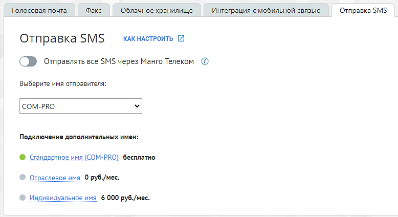
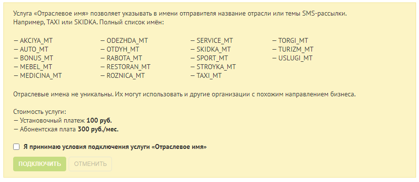

# 4.6.5.4. Отправка SMS

> Трассировка: PDF §4.6.5.4 · сквозные стр. 485-487 · источники: ч.5 `kb/mango-product-docs/sources/mango-lk-manual/LK_manual_v-121часть-5.pdf` с.81-83.

Данная вкладка предназначена для редактирования имени отправителя SMS- сообщения, которое отображается у пользователя при получении SMS-сообщения. Если тумблер "Отправлять все SMS через Манго Телеком" выключен, все исходящие SMS будут отправляться через оператора связи, номер которого указан в карточке сотрудника для исходящих звонков и сообщений.

По умолчанию установлено стандартное имя отправителя (COM-PRO). Выбор отраслевого имени Категорийное (отраслевое) имя отправителя SMS-сообщения указывается из списка. Отраслевое имя не является уникальным: его могут использовать организации, направление деятельности которых примерно совпадает с вашим.

Для выбора отраслевого имени примите условия подключения услуги, далее выберите из выпадающего списка подходящее имя отправителя и сохраните изменения кнопкой Сохранить.

Выбор уникального имени Уникальное имя – индивидуальное имя SMS-отправителя. Возможность использования уникального имени должна быть согласована с сотрудником компании Mango Telecom. Для выбора уникального имени выполните действия: • Щелкните по строке «Уникальное имя отправителя SMS» • Скачайте и заполните шаблоны документов; • Нажмите Создать заявку; Далее необходимо заполнить заявку на подключение уникального имени отправителя в SMS. Для этого: • Укажите имя отправителя в SMS (латинские буквы, не более 11 символов); • Укажите контактное лицо; • Приложите заполненные документы. Для этого в каждом поле поочередно нажмите Обзор и укажите путь к соответствующим документам. Кроме официального письма и заявления, вам потребуется приложить скан свидетельства о регистрации компании, доменного имени или товарного знака – в зависимости от выбранного имени. • Ознакомьтесь с условиями подключения, установите флаг «Я принимаю…»; • Нажмите Отправить. Далее заявка будет рассмотрена сотрудником компании Mango Telecom. В процессе рассмотрения заявки пиктограмма напротив имени услуги будет оранжевого цвета. В случае успешного согласования нового имени с SMS-агрегатором услуга будет подключена, о чем будет сигнализировать зеленая пиктограмма напротив названия услуги. Для смены имени отправителя выберите соответствующее имя из выпадающего списка и нажмите Сохранить. Если согласовать имя не удалось, вы получите соответствующее оповещение. В таком случае следует либо повторить процесс, указав новое имя, либо остановить его. При повторном изменении индивидуального имени допускается прикрепление ранее заполненных документов при условии, что значения реквизитов не изменились. У меня уже есть зарегистрированное имя Если у вас есть индивидуальное имя, согласованное с операторами связи через другой сервис, и которое вы хотите использовать в данном сервисе, то вам следует: 1. расторгнуть договор с сервисом; 2. отправить заявку в MANGO OFFICE, приложив необходимые документы.
