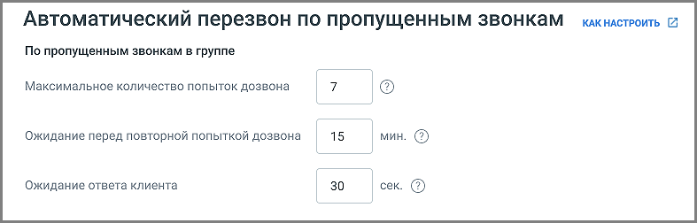
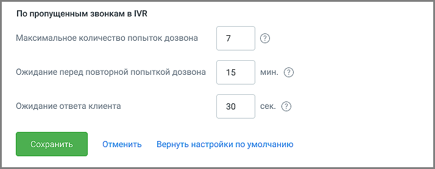

# 4.6.5.6. Автоперезвон

> Трассировка: PDF §4.6.5.6 · сквозные стр. 489-491 · источники: ч.5 `kb/mango-product-docs/sources/mango-lk-manual/LK_manual_v-121часть-5.pdf` с.85-87.

Инструмент служит для настройки автоматического перезвона по пропущенным звонкам. Вкладка отображается, если в разделе «Управление услугами» Личного кабинета подключена услуга Автоперезвон по пропущенным звонкам.

На вкладке доступны следующие настройки: По пропущенным звонкам в группе • Максимальное количество попыток дозвона – не более 10 попыток. • Ожидание перед повторной попыткой дозвона – не менее 60 секунд.

• Ожидание ответа клиента – не более 60 секунд. Попытка дозвона завершается, если клиент не ответил на звонок в течение указанного времени. Установленные значения меняются в настройках ЛК ВАТС, применяются ко всем группам, в настройках которых установлен чекбокс Автоперезвон, и являются одинаковыми для каждого из сценариев ответа абонента: номер занят, абонент не берёт трубку и номер абонента не доступен.

По пропущенным звонкам в IVR • Максимальное количество попыток дозвона – не более 10 попыток. • Ожидание перед повторной попыткой дозвона – не менее 60 секунд. • Ожидание ответа клиента – не более 60 секунд. Попытка дозвона завершается, если клиент не ответил на звонок в течение указанного времени. Общие настройки • Попытки дозвона прекращаются через – если перезвон не был осуществлён сотрудником в установленное время, задача на перезвон становится неактуальной и удаляется, чтобы не перезванивать по пропущенным вызовам слишком поздно, когда вопрос уже теряет свою актуальность.

Установленные значения меняются в настройках ЛК ВАТС, применяются к IVR, если в настройках схемы распределеления установлен чекбокс Автоперезвон, и являются одинаковыми для каждого из сценариев ответа абонента: номер занят, абонент не берёт трубку и номер абонента не доступен.

