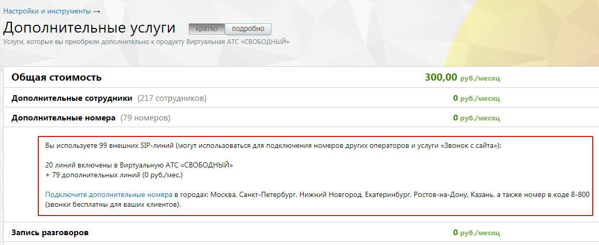

# 4.6.6. Управление услугами

> Трассировка: PDF §4.6.6 · сквозные стр. 491-493 · источники: ч.5 `kb/mango-product-docs/sources/mango-lk-manual/LK_manual_v-121часть-5.pdf` с.87-89.

Инструмент служит для агрегации информации о всех отдельно подключенных услугах (не входящих в текущую версию продукта) и быстрого перехода к управлению ими). Пользователю доступен следующий набор услуг: • Дополнительные сотрудники

• Дополнительные номера • Автоматическая подстановка АОН • Мультиканальные виджеты • Личный автосекретарь • Распознавание речи в голосовом меню • Возможность загрузки собственных мелодий и голосовых сообщений • Автоперезвон по пропущенным звонкам • Запись разговоров • Пакет «Мониторинг» • Алгоритмы распределения звонков в группе • Облачное хранилище • Автоинформатор о времени до ответа оператора • Автоинформатор о номере в очереди • Переадресация по номеру клиента • Виджет «Звонок на сайте» • Виджет «Обратный звонок» • Многоуровневое голосовое меню • Групповая видеоконференция • Речевая аналитика • Отраслевое имя • Голосовое сообщение при входящем звонке • Автоматическая отправка файла на E-mail • Подключение внешнего SIP-номера • Способы дозвона • Комнаты конференций • Интеграции

Чтобы подробнее ознакомиться с условиями подключения той или иной услуги, щелкните левой кнопкой мыши по наименованию услуги. внимание Инструмент доступен только для администратора Лицевого счета и пользователей с правом доступа «Администратор». Если в списке более двух услуг, то автоматически включается режим краткого описания. Для получения более подробной информации нажмите соответствующую кнопку. Узнать больше о конкретной услуге и перейти к ее настройке можно кликнув по строке с ее названием. Ниже отображается информационный блок с описанием и возможностью быстрого подключения других услуг. С их помощью существенно расширяются возможности, предоставляемые в рамках выбранного продукта.
