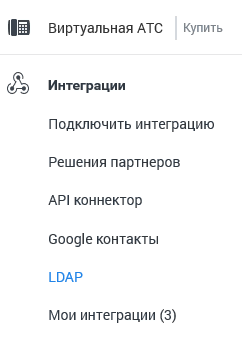

# 4.6.7. Интеграции

> Трассировка: PDF §4.6.7 · сквозные стр. 493-494 · источники: ч.5 `kb/mango-product-docs/sources/mango-lk-manual/LK_manual_v-121часть-5.pdf` с.89-90.

Данный инструмент предназначен для интеграции ВАТС со сторонними CRM- системами, облачными сервисами, бизнес-приложениями, базами данных и иными программными разработками. Интеграция ВАТС позволяет: • Повысить эффективность работы сотрудников; • Позвонить клиенту в один клик; • Предоставить информацию о клиенте до или во время звонка; • Получить полную историю взаимодействия с клиентами; • Повысить лояльность клиентов и снизить время их ожидания; • Настроить автоматическое распределение звонков по ответственным сотрудникам.

• Получить инструмент работы с записями разговоров; • Осуществлять импорт данных и формировать отчеты.

Зайдите в раздел, нажав на иконку в боковом меню Личного кабинета.

