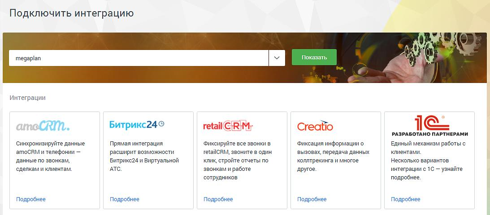
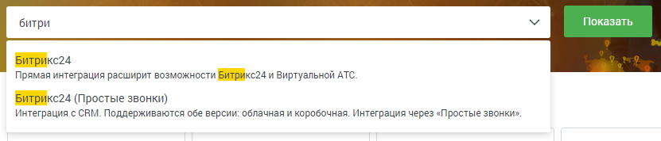
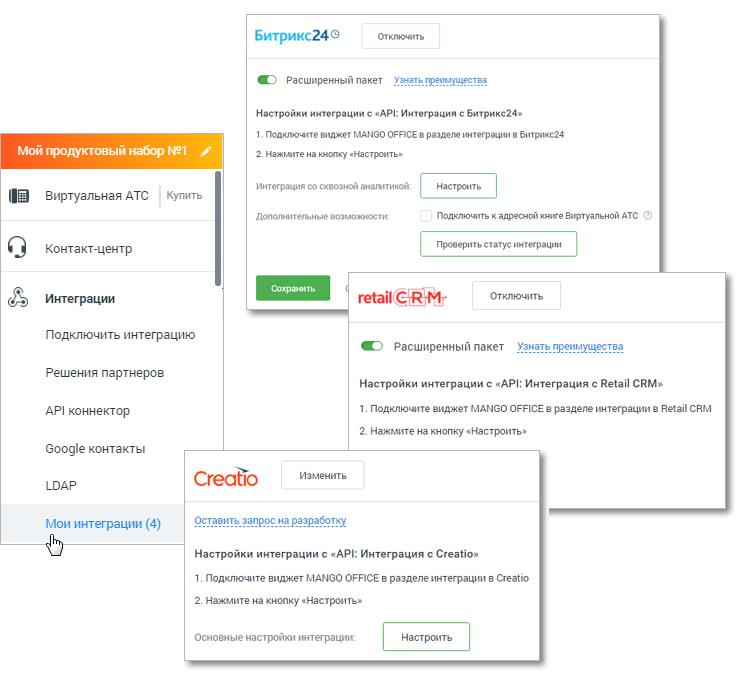
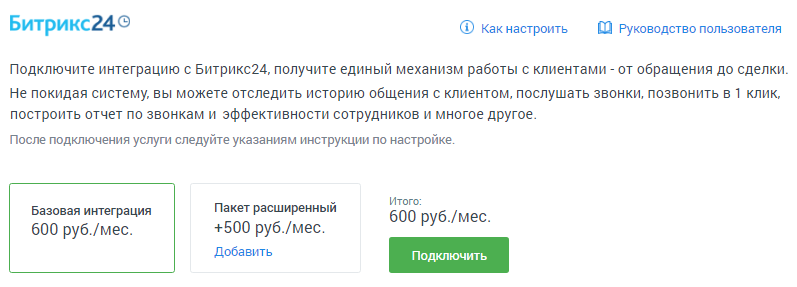
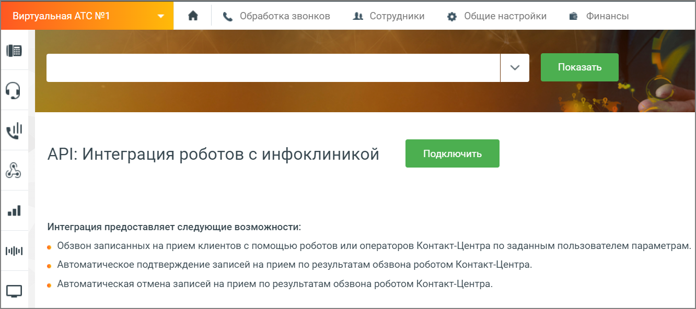
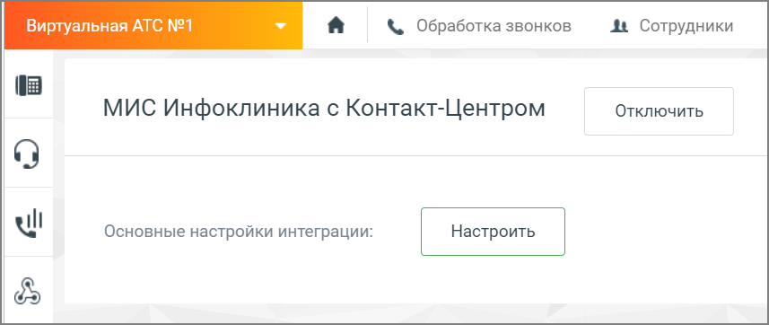
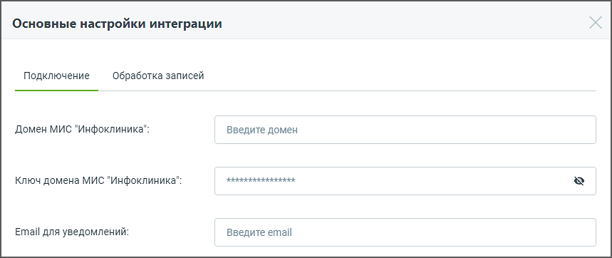
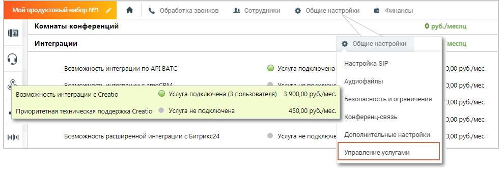
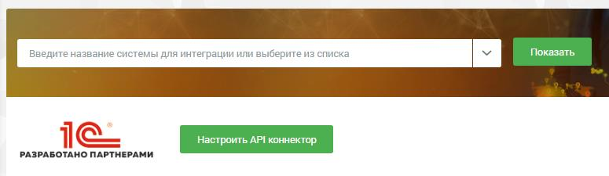
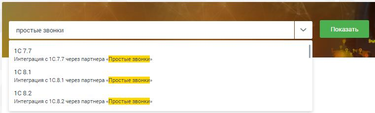

# 4.6.7.1. Подключить интеграцию

> Трассировка: PDF §4.6.7.1 · сквозные стр. 494-501 · источники: ч.5 `kb/mango-product-docs/sources/mango-lk-manual/LK_manual_v-121часть-5.pdf` с.90-97.

После перехода в подраздел Подключить интеграцию откроется список из 5-ти наиболее распространенных систем. Для просмотра полного списка кликайте по ссылке «Показать еще 10» в правом нижнем углу окна.

Пользователю доступны следующие варианты подключения: • amoCRM, Битрикс24 – «базовый» и «базовый плюс расширенный» варианты прямой интеграции с MANGO OFFICE; • 1С, Yсlients, Мегаплан – интеграция с MANGO OFFICЕ с использованием API- коннектор; • RetailCRM, ftp, Яндекс Диск, IDENT, Creatio, МИС Инфоклиника - прямая интеграция с MANGO OFFICЕ; • 1С 7.7, 1С 8.1, 1C 8.2, 1C 8.3, А2B, A&A Клуб, Бизнес.Ру, MS Access, ActiveX компонент, Baseplan, BPMSoft, Beauty Expert, CryptoCRM, Домопульт, Салоны Онлайн (Sonline), Умное ЖКХ, Excel, FrontPad, ITSM 365, JavaScript библиотека, Nemo.Travel, Okdesk, Orderino, Outlook, Pyrus, Партнер:Магазин, Ramex, Real Estate CRM, RoboMed, Simpla, Sycret , U-ON Travel, Universe SOFT, YCLIENTS, АРК Риелтор компании ТИСА, Арника, Инфо-Предприятие, ITSM365, МоиДокументы, МоиТуристы, Мой Класс, МойСклад, Омега-Плюс, Юздеск – интеграция через «Простые звонки». Предусмотрен быстрый поиск в списке интеграций – по наименованию и описанию:

внимание Для интеграции с использованием API-коннектора должна быть включена услуга «Возможность использовать API-коннектор»

Подключенные интеграции размещаются во вкладке Мои интеграции бокового меню. Там же можно изменить настройки, проверить статус, подключить к Адресной книге ВАТС, отключить интеграцию и др. возможности.

В блоке Для крупных клиентов размещаются: • API коннектор • Google контакты • Подключение по LDAP • Вебхуки внимание Доступ к функционалу инструментов регулируется настройками ролей пользователей на странице «Безопасность и ограничения». По умолчанию,

производить настройки функционала API ВАТС и подключать интеграции могут пользователи с ролью Администратор. Выберите систему и нажмите кнопку Подробнее. В открывшемся окне ознакомьтесь с возможностями системы. Далее следуйте инструкции по настройке, приведенной в Руководстве пользователя. amoCRM и Битрикс24 Для подключения интеграции с amoCRM или Битрикс24 следует выбрать тип интеграции. Просмотрите карточки возможностей, кликнув по иконке возможности левой кнопкой мыши. Выберите базовый либо расширенный тип и нажмите кнопку «Подключить».

В дополнение к возможностям базового типа, расширенный тип интеграции позволяет в том числе: • видеть канал рекламной кампании, по которому обратился клиент при помощи utm-меток динамического коллтрекинга в карточке звонка; • видеть название компании клиента благодаря интеграции с желтыми страницами; • анализировать количество звонков, которое теряется на группах сотрудников и голосовом меню; • работать с информацией о контактах из адресных книг продуктов MANGO OFFICE Виртуальной АТС Контакт-центра и Mango Talker; • отслеживать все пропущенные звонки • анализ разговоров с клиентами при помощи сервиса речевой аналитики MANGO OFFICE. • и др. При выборе расширенного типа дополнительно отображается настройка подключения CRM-системы к адресной книге Виртуальной АТС. При подключении автоматически выполняется синхронизация адресной книги Виртуальной АТС и CRM-системы.

внимание Подключение интеграции ВАТС и каждой из CRM-систем является платной услугой. Для её подключения ознакомьтесь с условиями и установите флаг «Я принимаю условия подключения услуги». В результате для подключенной CRM-системы осуществляется генерация уникального кода ВАТС и ключа для создания подписи. При необходимости допускается генерация нового кода и ключа посредством нажатия ссылки «Сгенерировать новый код и ключ». Действия по настройке интеграции CRM-системы и ВАТС приведены в инструкции по настройке для каждой CRM-системы. Для перехода к инструкции следует нажать на ссылку «Как настроить» напротив наименования CRM-системы. МИС Инфоклиника После настройки интеграции с «МИС Инфоклиника» медицинские компании, использующие в работе ПО «Инфоклиника», могут настроить взаимодействие ПО MANGO Office со своей системой. После настройки интеграции автоматизации подлежат следующие действия: • Обзвон записанных на прием клиентов с помощью роботов или операторов Контакт-Центра по заданным пользователем параметрам; • Автоматическое подтверждение записей на прием по результатам обзвона роботом Контакт-Центра; • Автоматическая отмена записей на прием по результатам обзвона роботом Контакт-Центра. Для интеграции с «МИС Инфоклиника» нажмите кнопку Подключить рядом с описанием CRM-системы.

Найдите блок настроек «МИС Инфоклиника» в разделе Мои интеграции.

Нажатие на кнопку Настроить открывает окно настроек интеграции.

Вкладка Подключение: • Домен МИС "Инфоклиника" – данные предоставляет владелей ПО «МИС Инфоклиника» при приобретении продукта. • Ключ домена МИС "Инфоклиника" – ключ предоставляется представителем компании "Инфоклиника". • Email для уведомлений – электронный адрес пользователя, на который будут приходить уведомления. Все поля обязательны для заполнения. Вкладка Обработка записей: в этой вкладке настраиваются условия отбора записей на прием в МИС Инфоклиника, по которым будет осуществляться Исходящий обзвон: время запуска, дата приема, время приема, название кампании Исходящего обзвона (для одной или нескольких записей). Нажатие на кнопку Добавить условие открывает новый блок добавления условий. Нажатие на кнопку Сохранить сохраняет внесенные изменения. Для получения дополнительной информации ознакомьтесь с Руководством

пользователя по интеграции коллтрекинга с МИС "Инфоклиника". Creatio Для интеграции с Creatio нажмите кнопку «Подробнее» под кратким описанием CRM- системы. Далее нажатие на кнопку Подключить открывает окно выбора опций подключения. Выберите: • Количество пользователей (минимально возможное количество - 3) • Наличие/отсутствие приоритетной поддержки Ознакомтесь со стоимостью услуги и нажмите кнопку «Подключить». внимание После подключения интеграции изменение количества пользователей или отключение услуги возможно только через личного менеджера. Статус интеграции можно посмотреть в разделе Общие настройки, вкладка Управление услугами.

1С Интеграция с платформой 1С доступна как через API коннектор MANGO OFFICE, так и через партнера «Простые звонки». При выборе интеграции через API коннектор нажмите кнопку «Подробнее» под кратким описанием CRM-системы на главной странице модуля «Интеграции».

Настройте API коннектор. При этом доступны следующие варианты интеграции с 1С: • Интеграция от сервиса simplit.io • Интеграция от компании «1C-Рарус» • Интеграция, встроенная в «1C: УНФ» При выборе интеграции через партнера «Простые звонки», введите в поисковой строке «Простые звонки» - и выберите в списке подходящую версию 1С.

Проставьте настройки на странице подключения в соответствии с инструкцией.
