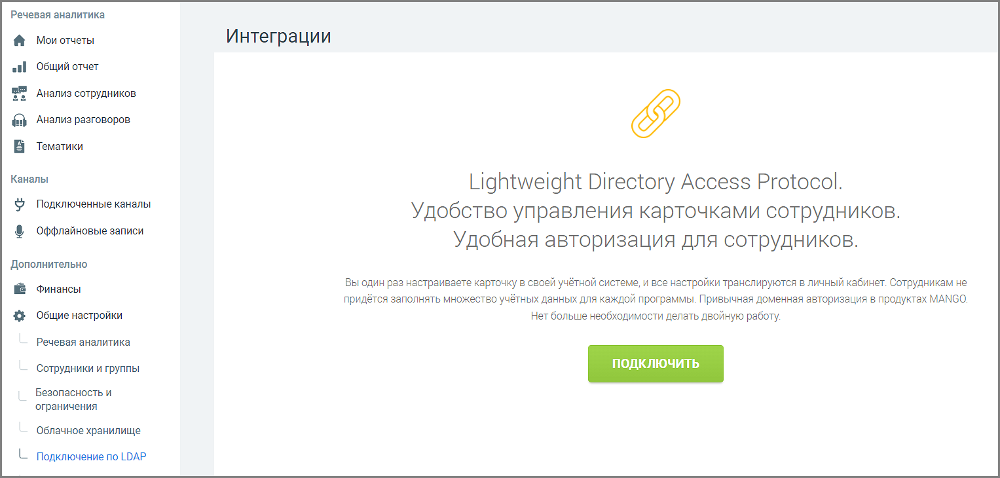

# 4.6.7.5. Подключение по LDAP

> Трассировка: PDF §4.6.7.5 · сквозные стр. 510-511 · источники: ч.5 `kb/mango-product-docs/sources/mango-lk-manual/LK_manual_v-121часть-5.pdf` с.106-107.

Данный инструмент предназначен для интеграции со сторонними сервисами по протоколу Lightweight Directory Access Protocol (LDAP) с целью синхронизации данных о сотрудниках.

Настройка подключения по LDAP будет доступна только после подключения услуги. Для этого нажмите Подключить, ознакомьтесь с условиями подключения и нажмите Подтвердить.

После подключения услуги необходимо произвести настройку функционала. Настройка осуществляется при помощи мастера настройки, определяющего порядок внесения информации. Настройка интеграции распределена на четыре шага: 1. Подключение к LDAP-серверу — ввод данных для подключения к сервису; 2. Сопоставление атрибутов — сопоставление информации между полями карточек; 3. Сопоставление сотрудников — поиск и сопоставление карточек сотрудников двух систем; 4. Настройка синхронизации — настройка синхронизации и расписания. Каждый последующий шаг доступен только при корректном выполнении предыдущего. По завершении настроек активируется кнопка Выполнить синхронизацию.
