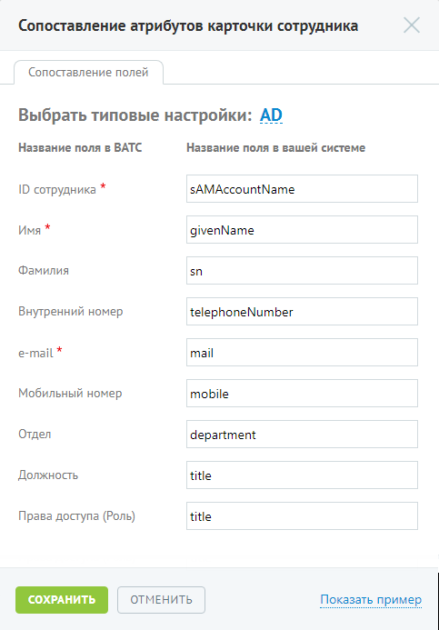

# Шаг 2. Сопоставление атрибутов

> Трассировка: PDF §4.6.7.5 · сквозные стр. 513-514 · источники: ч.5 `kb/mango-product-docs/sources/mango-lk-manual/LK_manual_v-121часть-5.pdf` с.109-110.

На данном шаге выполняется сопоставление полей карточки сотрудника в Личном кабинете соответствующим полям в учетной системе клиента.

Для упрощения настройки предлагаются наиболее распространенные параметры для каждого из полей. Данные настройки подставляются при нажатии кнопки AD в заголовке. Поля, отмеченные «*», являются обязательными для заполнения. При нажатии на кнопку Показать пример введенные настройки сохраняются, после чего из сторонней системы согласно настройкам сопоставления полей, отобразятся значения соответствующие полям из сопоставления. Возврат в режим редактирования сопоставления осуществляется нажатием по ссылке Вернуться к настройке.

При корректной настройке становится доступными шаги 3 и 4.
