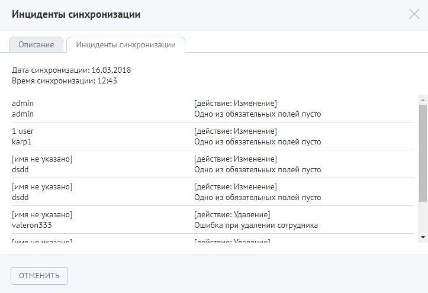

# Шаг 4. Настройка синхронизации

> Трассировка: PDF §4.6.7.5 · сквозные стр. 517-521 · источники: ч.5 `kb/mango-product-docs/sources/mango-lk-manual/LK_manual_v-121часть-5.pdf` с.113-117.

Настройки данного шага разнесены на две вкладки: • Политика синхронизации — ключевые и дополнительные параметры синхронизации; • Расписание — расписание автоматической синхронизации либо ручной запуск.

Вкладка «Политика синхронизации» содержит следующие параметры: Политика синхронизации Внимание Если пользователь не установил ни одного флага ключевых возможностей в данном блоке настроек, то при сохранении формы на экране отобразится сообщение о необходимости включения хотя бы одной настройки. В противном случае форма будет недоступна для сохранения. Создавать новых сотрудников — при установленном флаге в процессе синхронизации все новые сотрудники из сторонней системы будут автоматически добавляться в личный кабинет. Определение того, что сотрудник является «новым» происходит в случае, если для данной карточки сотрудника в сторонней системе нет сопоставления карточки сотрудника в Личном кабинете. Сопоставление карточек происходит по заданному идентификатору. В случае, когда флаг не установлен, добавление новых сотрудников следует выполнять в ручном режиме. Данная настройка не применяется для тех пользователей внешней учётной системы, которые занесены в исключения. Инцидент о невозможности создания такого пользователя будет указан на форме «Инциденты синхронизации». Внимание Тарификация за добавление нового сотрудника осуществляется в соответствии с тарифами вашей версии ВАТС Изменять существующих — при установленном флаге в процессе синхронизации карточек существующих сотрудников, для которых установлен флаг «Управление по LDAP», данные в Личном кабинете будут заменяться данными из сторонней системы. Данная настройка не будет применяться для тех пользователей внешней учётной системы, для которых отключена возможность синхронизации. Инцидент о невозможности изменения данных такого пользователя будет указан на форме «Инциденты синхронизации». Удалять отсутствующих — при установленном флаге в процессе синхронизации карточек существующих сотрудников, для которых установлен флаг «Управление по LDAP», в случае когда сотрудник отсутствует в сторонней системе, но присутствует в Личном кабинете, все его средства приёма звонков, указанные в карточке сотрудника, помечаются как не активные. Удаление карточки является обязанностью администратора, поскольку сотрудник может участвовать в схемах распределения звонков и пр. Определение того, что сотрудник является «отсутствующим» происходит в случае, если для данной карточки сотрудника в сторонней системе нет сопоставления карточки сотрудника в Личном кабинете.

Разрешить доменную авторизацию — при установке данного флага для данной компании разрешается доменная авторизация. Дополнительным условием возможности доменной авторизации является указание корректного и уникального доменного имени. E-mail для отправки уведомлений — поле используется для указания адреса электронной почты для получения сообщений об инцидентах при синхронизации. Дополнительные параметры Создавать учетную запись SIP для новых сотрудников — при установленном флаге для всех новых сотрудников выполняется создание учетной записи SIP. Выпадающий список сдержит доступные для выбора домены, где будут создаваться учетные записи. Если выбран домен, создание учетных записей в котором платное, при создании учетной записи отображается системное уведомление о тарификации. Информация о созданной учётной записи будет отображена на форме «Инциденты синхронизации». Автоматическая подстановка ролей — при установке данного флага в синхронизируемые карточки сотрудников подставляются соответствующие роли. При этом возможны следующие случаи: 1. Услуга «Роли» не доступна в текущей версии ВАТС — при этом сопоставление будет выполняется по базовым ролям; 2. Услуга «Роли» доступна, но не подключена — при выборе опции услуга будет автоматически подключена. За использование расширенного набора ролей взимается дополнительная плата; 3. Услуга «Роли» доступна и подключена — сопоставление будет выполняться по всем доступным ролям. Разрешить доменную (Windows/NTLM) авторизацию — при установке данного флага для данного лицевого счета допускается NTLM-авторизация сотрудников. При этом на форме отображаются дополнительные элементы: 1. Кнопка Скачать скрипт. При нажатии кнопки выполняется автоматическое скачивание скрипта. 2. Ссылка для ознакомления с техническим описанием настройки; 3. Поле для ввода ссылки на рабочий скрипт. Для того, чтобы разрешить доменную авторизацию, следует скачать и установить скрипт, после чего указать ссылку на рабочий скрипт в соответствующем поле. Установить для импортируемых карточек Поле «Исходящий номер» — выбор исходящего номера из списка имеющихся номеров в ВАТС; Поле «Принимать звонки» — выбор способа дозвона. В случае, когда в текущей версии ВАТС доступна опция «Дозвон на все номера одновременно», то она устанавливается по умолчанию;

Поле «Направление» - данная настройка не доступна для редактирования и информирует о значении, которое будет установлено по умолчанию для новых карточек. Для сохранения настроек следует нажать Сохранить. Вкладка «Расписание» содержит параметры для настройки расписания синхронизации: • Автоматически каждые 1, 2, 3, 4, 8, 12 часов; • Автоматически ежедневно в указанное время; • Вручную. Для сохранения настроек следует нажать Сохранить. В результате выполненных настроек закладка «Подключение по LDAP» принимает следующий вид:

Для ручного запуска синхронизации нажмите кнопку Выполнить синхронизацию. По выполнении синхронизации на экране отображаются результаты вида:

При наличии инцидентов, созданных в процессе синхронизации, в результатах отображается ссылка для их просмотра. При нажатии на ссылку на экране отображается список инцидентов с описанием причины возникновения ошибки.

Для отключения щелкните по кнопке Изменить и выберите отключение услуги.
