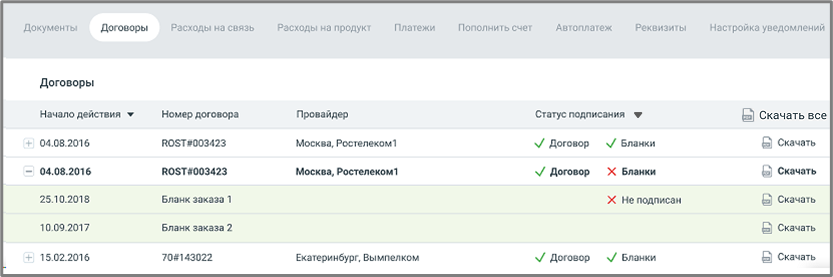

# 2.2. Договоры

> Трассировка: PDF §2.2 · сквозные стр. 29-30 · источники: ч.1 `kb/mango-product-docs/sources/mango-lk-manual/LK_manual_v-121часть-1.pdf` с.29-30.

Список «Период» позволяет установить вариант выбора дат (по умолчанию предлагается период «Произвольный»), нажав значок календаря, или ввести их в формате дд.мм.гггг в соответствующие поля. В списке «Формат» задайте нужный (по умолчанию выбран PDF, доступны также XLS, XLSX и TXT). Нажмите кнопку «Сформировать», и появится стандартное диалоговое окно браузера, позволяющее открыть или сохранить файл.

Внимание Первого числа любого месяца (с 00:00 до 00:00 следующего дня) получение детализации недоступно по причине формирования инвойсов за предыдущий отчетный период. 2.2 ДОГОВОРЫ В разделе отображается список договор пользователя, с возможностью скачивания документов. Видимость списка зависит от настроек прав доступа роли текущего пользователя. Список доступен также пользователям со стандартными ролями «Руководитель компании», «Бухгалтер» и «Администратор».

