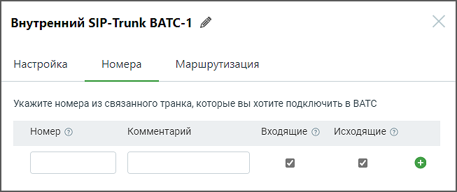

# 5.3.2.2. Номера

> Трассировка: PDF §5.3.2.2 · сквозные стр. 536-537 · источники: ч.5 `kb/mango-product-docs/sources/mango-lk-manual/LK_manual_v-121часть-5.pdf` с.132-133.

Заполните поля: Номер – здесь необходимо указать номера для связанного транка из ВАТС-2 Формат ввода номера - E.164 без пробелов, например 74951234567. При заполнении остальных полей формы, руководствуйтесь инструкциями, предоставленными в разделе Номера для внешнего SIP Trunk.

