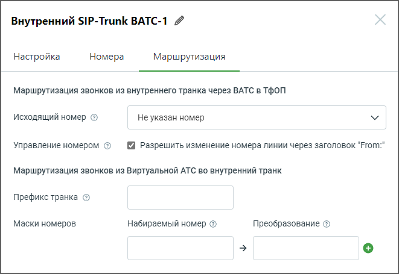

# 5.3.2.3. Маршрутизация

> Трассировка: PDF §5.3.2.3 · сквозные стр. 537-538 · источники: ч.5 `kb/mango-product-docs/sources/mango-lk-manual/LK_manual_v-121часть-5.pdf` с.133-134.

При заполнении полей формы, руководствуйтесь инструкциями, предоставленными в разделе Маршрутизация для внешнего SIP Trunk.

