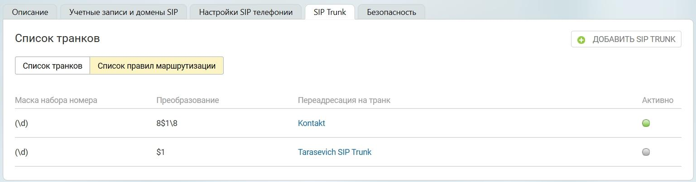

# 5.4.2. Список правил маршрутизации

> Трассировка: PDF §5.4.2 · сквозные стр. 541 · источники: ч.5 `kb/mango-product-docs/sources/mango-lk-manual/LK_manual_v-121часть-5.pdf` с.137.

Маска набора номера - задается пользователем во вкладке «Маршрутизация»; Преобразование - задается пользователем во вкладке «Маршрутизация»; Переадресация на транк - название транка, для которого установлена данная маска; Активно - отображает текущий статус маски.
