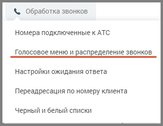
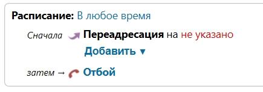
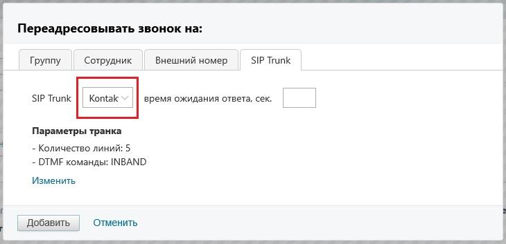
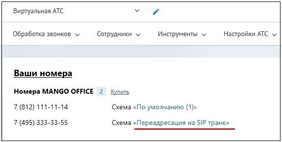

# 5.5. Настройка схемы распределения звонков в Личном кабинете

> Трассировка: PDF §5.5 · сквозные стр. 541-544 · источники: ч.5 `kb/mango-product-docs/sources/mango-lk-manual/LK_manual_v-121часть-5.pdf` с.137-140.

кабинете Для настройки схемы распределения звонков откройте подраздел “Голосовое меню и распределение звонков” в разделе “Обработка звонков” в Личном кабинете пользователя ВАТС.

Панель настройки содержит вкладки: ● Настройки для входящих линий ● Дополнительные настройки

Выберите из списка телефонный номер, подключенный через сип-транк, для которого будет настраиваться схема. Далее действуйте согласно информации раздела о создании схем переадресации.

Для создания схемы, включающей переадресацию звонков на SIP Trunk кликните по ссылке “не указано”.

В открывшейся форме выберите вкладку SIP Trunk. В выпадающем окне содержится список всех активных транков с типом вызова «Входящий». При выборе транка в окне отображаются его параметры.

Важно: При необходимости, параметры транка можно отредактировать, кликнув по кнопке Изменить.

Установите время ожидания ответа, затем сохраните внесенные изменения кнопкой Добавить. Настроенная схема переадресации звонка отобразится на главной панели Личного кабинета

