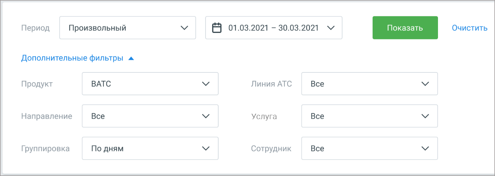

# 2.3. Расходы на связь

> Трассировка: PDF §2.3 · сквозные стр. 30-32 · источники: ч.1 `kb/mango-product-docs/sources/mango-lk-manual/LK_manual_v-121часть-1.pdf` с.30-32.

Таблица договоров содержит следующие поля:

Пиктограммы / – закрытый/открытый список бланков заказа, в составе договора. Если с договором есть хотя бы один связанный бланк заказа, то вначале строки договора отображается пиктограмма "+". При нажатии пиктограмма разворачивает список бланков заказа. Чтобы свернуть список бланков кликните по пиктограмме "-"; Начало действия – начало действия договора. По умолчанию новые договора размещены в начале списка; Номер договора – номер заключенного договора; Название провайдера – провайдер, с которым заключен договор;

Статус подписания – документ подписан, документ не подписан. Доступна сортировка по статусу. Скачать – сохраните документ, используя стандартные средства Windows; Скачать все – сохраните все документы, отображаеме в таблице выдачи. В случае наличия неподписанных документов справа от списка выводится предупреждение о возможном приостановлении услуг связи и информационное сообщение:

2.3 РАСХОДЫ НА СВЯЗЬ Этот раздел поможет составить полную картину расходов на телефонную связь: • сколько было звонков;

• куда звонили; • каковая общая длительность звонков; • какая сумма потрачена на звонки. Гибкие настройки позволят выбрать любые необходимые данные для отчета: использование услуг (например, длительность и стоимость разговоров), продукт, период, направления звонков, линии АТС и сотрудники. А также указать желаемый вариант группировки данных.

внимание

| Отчет Расходы на связь отображается в ЛК только если на ВАТС подключена |
| --- |
| соответствующая услуга. |

Варианты фильтрации: Период – Произвольный, Текущая неделя, Текущий месяц, С прошлого месяца, С позапрошлого месяца, Текущий год, Весь период; Продукт – все продуктовые наборы ЛК; Направление – доступные для выбора варианты зависят от значения, выбранного в списке Услуга; Группировка – По дням, По месяцам, По сотрудникам, По линиям, По услугам; Линия АТС – список всех доступных активных линий на выбранном продукте ВАТС. Услуга – Все услуги, Входящие на 8-800, Конференции, SIP, Сторонние SIP (SIP UAC), Сторонние SIP (SIP транки), SMS, Исходящий обзвон, Переадресация, Исходящие, Остальное; Сотрудник – список всех доступных сотрудников на выбранном продукте ВАТС. Рассмотрим пример выборки данных для составления отчетов. Пример 1. Узнать, сколько было звонков за март 2018г. на ВАТС №1, какова их общая длительность и стоимость, с группировкой по дням.

