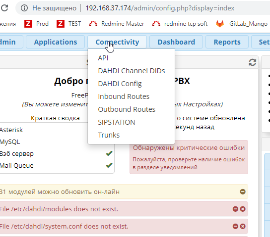
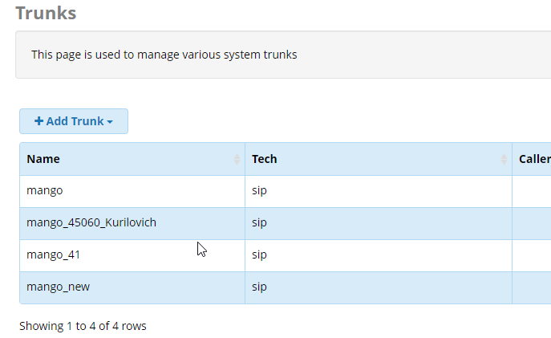
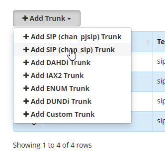
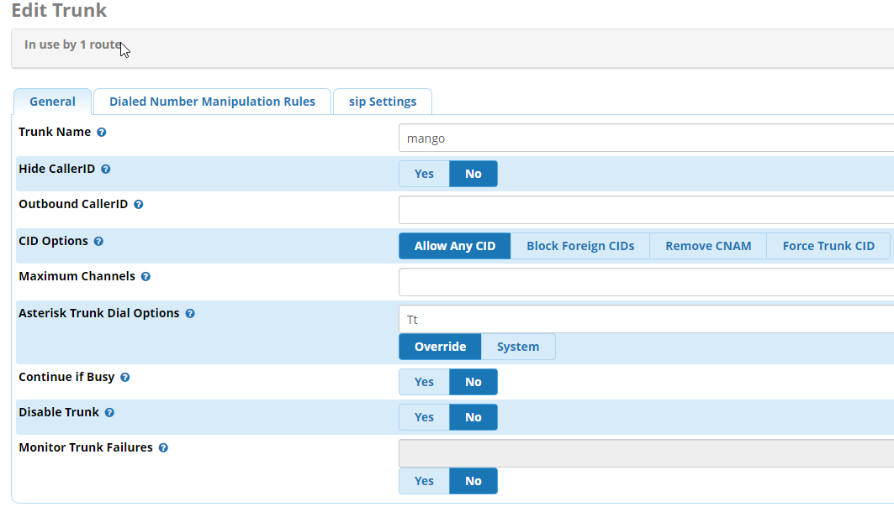
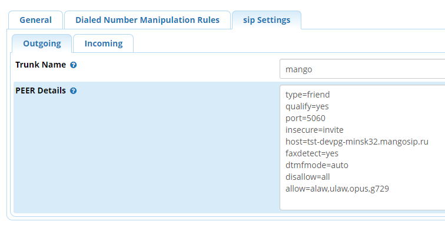
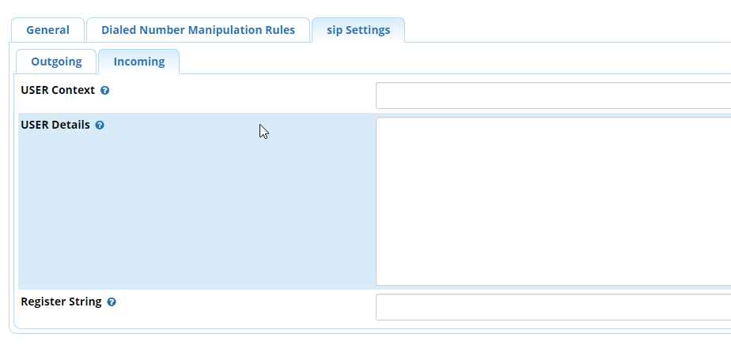

# 5.7.1. Создание SIP trunk для FreePBX (Asterisk)

> Трассировка: PDF §5.7.1 · сквозные стр. 552-559 · источники: ч.5 `kb/mango-product-docs/sources/mango-lk-manual/LK_manual_v-121часть-5.pdf` с.148-155.

Откройте меню администрирования транков во вкладке Trunks раздела

Connectivity.

Нажмите кнопку «Add Trunk» и выберите тип создаваемого транка.

Выберите вариант Add SIP (chan_sip) Trunk.

Вкладка General На вкладке задаются основные параметры SIP транка.

Заполните поля формы: Trunk Name - Название транка. В примере используем имя mango. Назначьте удобное для вас имя, для легкого распознавания среди других транков; Hide CallerID - Опция скрытия CID при исходящем вызове; Outbound CallerID CID, который будет передаваться при исходящем вызове; CID Options - Настройки передачи CID – разрешить все, запретить иностранные и т.д.; Maximum Channels - максимальное количество одновременных разговоров вне локальной сети; Asterisk Trunk Dial Options - модификация Dial options, в данном случае оставим опцию дефолтной; Continue if Busy - опция направления вызова на следующий транк даже если канал сообщает «BUSY» или «INVALID NUMBER»; Disable Trunk - опция выключения транка. Далее необходимо выполнить настройку во вкладке «sip Settings».

Вкладка «sip Settings» Устанавливаем ключевые наcтройки sip пира. Во FreepBX они разделены на Outgoing и Incoming. Которые отвечают за исходящие type=peer и входящие вызовы type=user, соответственно. Настройка исходящих вызовов в закладке «Outgoing» Дублируете название транка в поле Trunk Name. В поле Peer Details размещаются настройки:

На скриншоте приведены наиболее распространенные параметры. Точная настройка делается администратором пользователя, в зависимости от конфигурации PBX. Очередность параметров не является обязательной. type=friend ● peer: SIP запись, которую Asterisk может использовать для совершения

| исходящих вызовов (например, SIP провайдер). А также для входящих |
| --- |
| вызовов, если Вам необходимо сопоставить эту запись не с именем |
| пользователя из поля FROM, а с IP адресом, указанным для этой записи. Для |
| записи этого типа, для входящих вызовов, никогда не будет проверяться |

| соответствие имени пользователя и пароля, а только соответствие с IP |
| --- |
| адресом и номером порта источника вызова. SIP клиент, типа peer, при |
| совершении исходящих вызовов использует авторизацию, если она будет |
| затребована вызываемой стороной. |

|  | SIP запись, через которую вызовы могут поступать из вне в Asterisk |
| --- | --- |
| (телефон, который может только совершать вызовы). Пользователи, для |  |
| которых назначены, доступные им, сервисы в определенных для них |  |
| контекстах. |  |

● friend: Запись, которая одновременно и user и peer. Этот тип наиболее

| подходит для телефонов и других устройств. Для SIP пользователей этого |
| --- |
| типа Asterisk создаст два объекта, один типа peer и один типа user, с |
| одинаковыми именами. |

qualify=yes посылать SIP запросы OPTIONS для проверки доступности устройства host= sip сервер провайдера, предоставляется Mango Office port порт сигнализации sip сервера, предоставляется Mango Office transport=udp транспорт для sip протокола insecure=port,invite port - не требовать совпадения порта в инвайте invite - не требовать аутентификации в инвайте dtmfmode=rfc2833 использовать спецификацию rfc2833 для передачи DTMF сигналов disallow=all запретить использование всех кодеков, чтобы затем разрешить определенные. allow=alaw.. разрешить использование кодеков, чтобы затем разрешить определенные. peer - SIP запись, которую Asterisk может использовать для совершения исходящих вызовов (например, SIP провайдер). А также для входящих вызовов, если Вам необходимо сопоставить эту запись не с именем пользователя из поля FROM, а с IP адресом, указанным для этой записи. Для записи этого типа, для входящих вызовов, никогда не будет проверяться соответствие имени пользователя и пароля, а только соответствие с IP адресом и номером порта источника вызова. SIP клиент, типа peer, при совершении исходящих вызовов использует авторизацию, если она будет затребована вызываемой стороной.

Если клиент типа peer (тип friends включает в себя peer) определен с параметром host=dynamic, то он должен зарегистрироваться на Asterisk, для того, чтобы сервер мог найти его (IP адрес или имя хоста), и для того, чтобы сервер знал, что данный клиент доступен для совершения вызовов в его сторону. Сопоставление входящих вызовов с клиентами и пирами Обычно, Asterisk ищет подходящего SIP клиента, при поступлении входящего вызова, по полю From: username (без доменной части). Однако, если Asterisk не смог найти подходящего пользователя для поступившего вызова, то он будет использовать IP адрес звонящего для поиска подходящего SIP пира с соответствующим адресом. Если же и после этого нет совпадений, тогда вызов будет отправлен на обработку в контекст, определенный в секции [general] файла sip.conf. Проверьте правильность заполнения полей, нажмите Submit и Apply Config. ПОЯСНЕНИЕ: Для простоты можно сказать, что контекст транка определяет, как обрабатывать входящие вызовы, а контекст внутреннего номера - исходящие. Когда внутренний абонент куда-то звонит, в назначенном ему контексте определяется, через какие транки и куда он может позвонить. Исходящая связь через транк определяется в контекстах внутренних номеров и никак не упоминается в контексте, назначенном непосредственно транку. Настройка входящих вызовов в закладке «Incoming» Закладка Incoming остается пустой.

