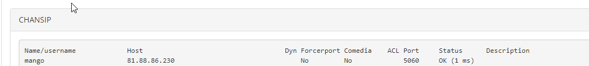

# 5.7.1.1. Как проверить состояние транка

> Трассировка: PDF §5.7.1.1 · сквозные стр. 559 · источники: ч.5 `kb/mango-product-docs/sources/mango-lk-manual/LK_manual_v-121часть-5.pdf` с.155.

Проверить состояние транка можно через меню Reports-Asterisk Info:

