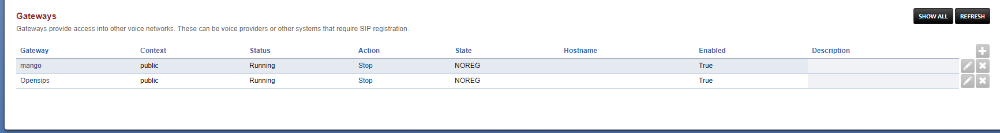
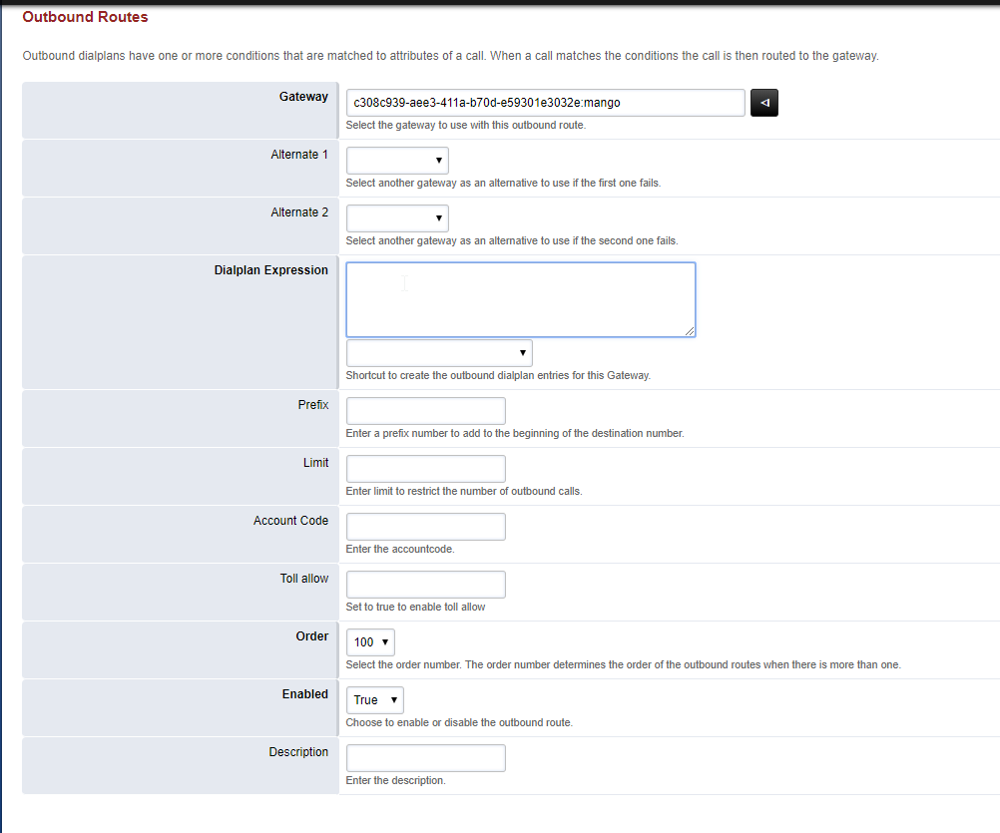

# 5.7.2.1. Исходящая маршрутизация

> Трассировка: PDF §5.7.2.1 · сквозные стр. 565-567 · источники: ч.5 `kb/mango-product-docs/sources/mango-lk-manual/LK_manual_v-121часть-5.pdf` с.161-163.

Outbound Routes - Исходящая маршрутизация FusionPBX (Freeswitch). Для создания правила исходящей маршрутизации выбираем Dialplan-Outbound Routes Выберете основной gateway для вызовов Введите шаблон (pattern) набираемого номера, например:

Данный шаблон соответствует номерам из 10 цифр начинающимся на 795

