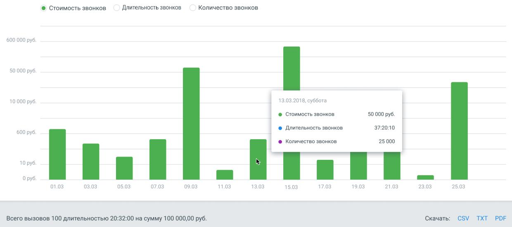

# 2.4. История Платежей

> Трассировка: PDF §2.4 · сквозные стр. 32-34 · источники: ч.1 `kb/mango-product-docs/sources/mango-lk-manual/LK_manual_v-121часть-1.pdf` с.32-34.

Выберите вкладку «Расходы на связь», а в списке «Период» — вариант «01.03.2018 – 31.03.2018». Поле «Группировка» - вариант «по дням». Поле «Продукт» - «ВАТС №1». Поля «Направления», «Линия АТС», «Услуги» и «Сотрудники» – вариант «Все». Нажмите кнопку «Показать». На гистограмме отобразятся данные длительности и стоимости вызовов, разделеные на разряды, c разбивкой по дням (как на рисунке ниже).

Аналогичные данные содержатся и в табличном виде. Можно сохранить полученный отчет, кликнув по значку нужного формата файла (появится стандартное диалоговое окно браузера, позволяющее открыть или сохранить файл). 2.4 ИСТОРИЯ ПЛАТЕЖЕЙ Список «Период» позволяет установить вариант выбора дат (по умолчанию предлагается период «Произвольный»), нажав значок календаря, или ввести их в формате дд.мм.гггг в соответствующие поля. Кнопка «Очистить» возвращает к значению по умолчанию.

Нажмите кнопку «Показать», и появится отчет о платежах, осуществленных в течение указанного периода. При наведении на строку, соответствующую конкретному платежу, отображется кнопка- ссылка "Электронный чек".

Нажатие на кнопку открывает форму 1 – Электронный чек, с данными ФН, ФД и ФПД. Нажатие на кнопку Получить чек открывает форму 2 в новой странице браузера. Скопируйте одноименные данные из формы-1 в форму-2 и нажмите Найти. Сохраните полученный электронный чек.

