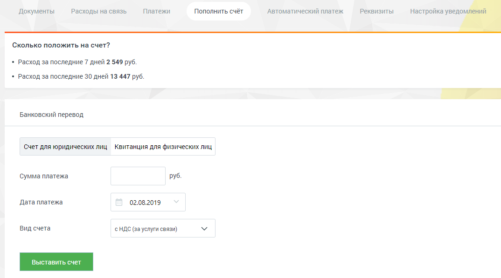

# 2.5.1.1. Для юридических лиц

> Трассировка: PDF §2.5.1.1 · сквозные стр. 35 · источники: ч.1 `kb/mango-product-docs/sources/mango-lk-manual/LK_manual_v-121часть-1.pdf` с.35.

Для оплаты услуг «Манго Телеком» юридическими лицами с использованием банковских переводов (ИНН/КПП, банковские реквизиты) выберите вкладку «Счет для юридических лиц».

Заполните нужные поля и нажмите кнопку Выставить счет. В результате откроется готовый к печати документ «Счет» в формате PDF. Реквизиты документа заполняются автоматически на основании данных, указанных на вкладке «Реквизиты».
