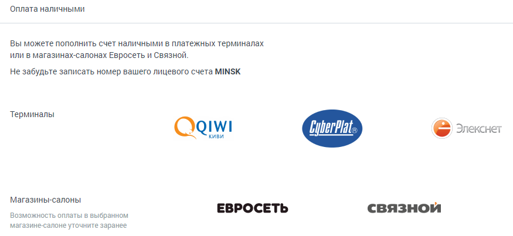

# 2.5.4. Оплата наличными

> Трассировка: PDF §2.5.4 · сквозные стр. 38-40 · источники: ч.1 `kb/mango-product-docs/sources/mango-lk-manual/LK_manual_v-121часть-1.pdf` с.38-40.

Пополнение счета возможно при помощи наличных денежных средств через платежные терминалы и в магазинах-салонах «Евросеть» и «Связной».

Если у вас остались вопросы по внесению платежей, то рекомендуем посетить официальные сайты платежных систем: • Paymaster – www.paymaster.ru • PayOnline – www.payonline.ru • ЮMoney— www.yoomoney.ru • QIWI – www.qiwi.com

