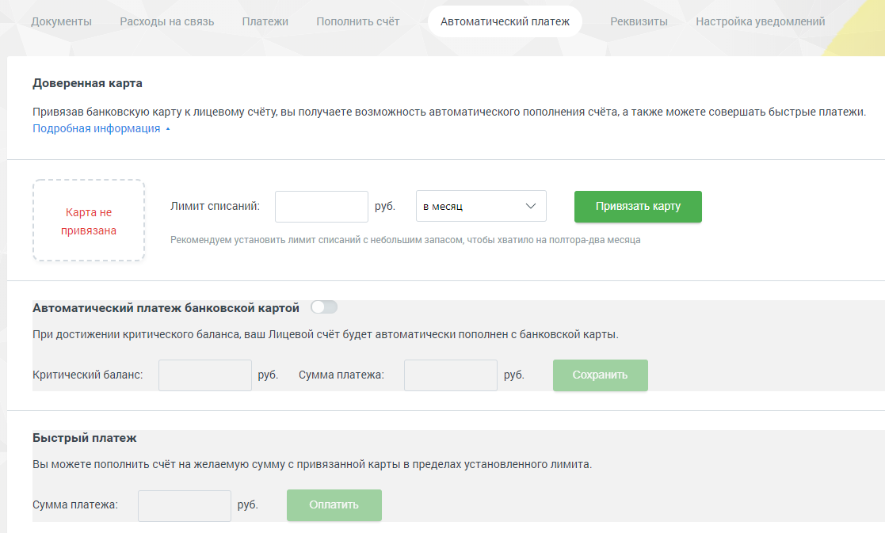

# 2.6. Автоматический платеж

> Трассировка: PDF §2.6 · сквозные стр. 40-42 · источники: ч.1 `kb/mango-product-docs/sources/mango-lk-manual/LK_manual_v-121часть-1.pdf` с.40-42.

Пополнение счета через QR-код производится с помощью сервиса PayMaster, без взимания комиссии. Введите цифрами сумму платежа в одноименное поле. Нажмите кнопку «Перейти к оплате». В результате в новой вкладке браузера откроется страница с QR-кодом. Откройте на смартфоне мобильное приложение вашего банка. Далее действуйте по приведенной выше инструкции. 2.6 АВТОМАТИЧЕСКИЙ ПЛАТЕЖ Внимание Раздел доступен только для пользователей с ролью «Администратор лицевого счета». Привязка банковской карты позволит настроить автоматическое пополнение платежа в соответствии с указанным лимитом, или совершить быстрый платеж.

Внимание Сервисы по оплате и подтверждению доверенности на совершение автоматических платежей предоставляются системой электронных платежей компании PayMaster. Компания «Манго-Офис» (www.mango-office.ru) не получает персональные и банковские данные клиента. Доверенная карта Для привязки банковской карты установите лимит, минимально допустимое значение – 100 рублей. Затем выберите период и нажмите кнопку Привязать карту. В результате будет выполнена переадресация на соответствующую страницу сайта компании PayMaster для указания необходимых данных. После того, как вы указали все данные, осуществляется возврат на страницу Личного кабинета с указанием полученной информации.

В строке «Лимит обновится» указывается дата и время перехода в новый лимитный период. Чтобы отвязать банковскую карту, нажмите кнопку «Отвязать карту». Карта будет отвязана после нажатия кнопки без дополнительных предупреждений. Автоматический платеж банковской картой Данная настройка позволяет указать величину критического баланса, при достижении которого будет автоматически внесен платеж в указанном размере в рамках лимита списаний.

