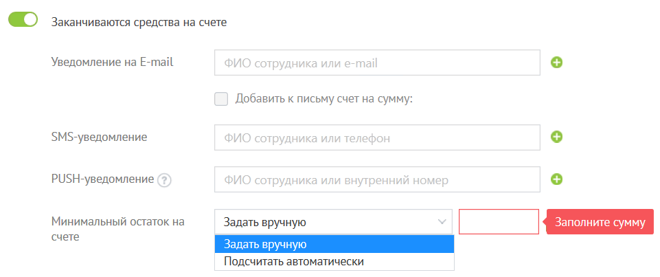

# 2.8. Настройка уведомлений

> Трассировка: PDF §2.8 · сквозные стр. 43-45 · источники: ч.1 `kb/mango-product-docs/sources/mango-lk-manual/LK_manual_v-121часть-1.pdf` с.43-45.

Когда все будет готово, нажмите Отправить. На странице отобразится блок подтверждения с номером созданной заявки, который предназначен для отслеживания ее статуса. Для изменения контактных данных введите информацию (например, новый номер телефона или адрес электронной почты) в соответствующие поля одноименного блока. Если нужно добавить еще одно поле (например, еще один номер телефона), нажмите

кнопку , а для удаления лишнего — . Подтвердите операцию, нажав Сохранить. 2.8 НАСТРОЙКА УВЕДОМЛЕНИЙ Уведомления о событиях можно получать по электронной почте, в виде SMS-сообщений и PUSH-уведомлений. Блок «Заканчиваются средства на счете» внимание Рекомендуем настроить уведомление по SMS о критическом остатке на счете. Уведомление о критическом остатке отсылается не чаще одного раза в пять дней.

Для уведомления о критическом остатке на Лицевом счете выберите из списка нужное значение параметра «Минимальный остаток на счете»: • задать вручную — критический остаток указывается в соответствующем поле (при выборе этого пункта в поле для ввода суммы по умолчанию подставляется 100 рублей) • подсчитать автоматически — расчет производится на основании информации об использовании услуг «Манго Телеком» по этому Лицевому счету за последнюю неделю (поле для ввода суммы остается неактивным);

Вы можете отметить пункт «Добавить к письму счет на оплату» и ввести сумму (по умолчанию подставляется — 1100 рублей). В этом случае в письме с уведомлением будет содержаться и счет на оплату. Блоки «Блокировка и разблокировка услуг» и «Зачисление средств на счет» Отметьте пункты для типов уведомлений, которые хотите получать, проставив галочки в соответствующие поля.

совет SMS-сообщения отправляются только на номера российских операторов сотовой связи, записанные в формате +79ххххххххх. Можно указывать несколько адресов электронной почты, разделяя их запятыми. Последние введенные данные автоматически подставляются в аналогичное пустое поле при переходе на него. Для пользователей с правами «Администратор ВАТС» и «Администратор Лицевого счета» отображается блок «Подписка на бизнес-рецепты». Используя этот блок, вы можете подписаться на еженедельную рассылку бизнес- рецептов в виде интересных статей и практических советов по настройке и использованию Виртуальной АТС и других продуктов «Манго Телеком». Введите адрес в соответствующее поле и нажмите «Подписаться». На указанный почтовый ящик придет письмо со ссылкой. Перейдите по ней для активации подписки. Если тумблер блока включен, но при этом не указан ни один адрес для отправки, кнопка Сохранить недоступна для нажатия. Кнопка Отменить возвращает данные к последнему сохраненному состоянию.

