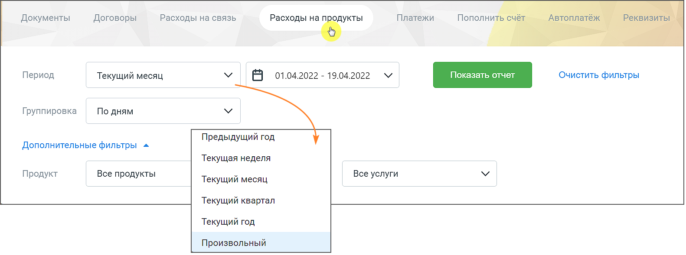
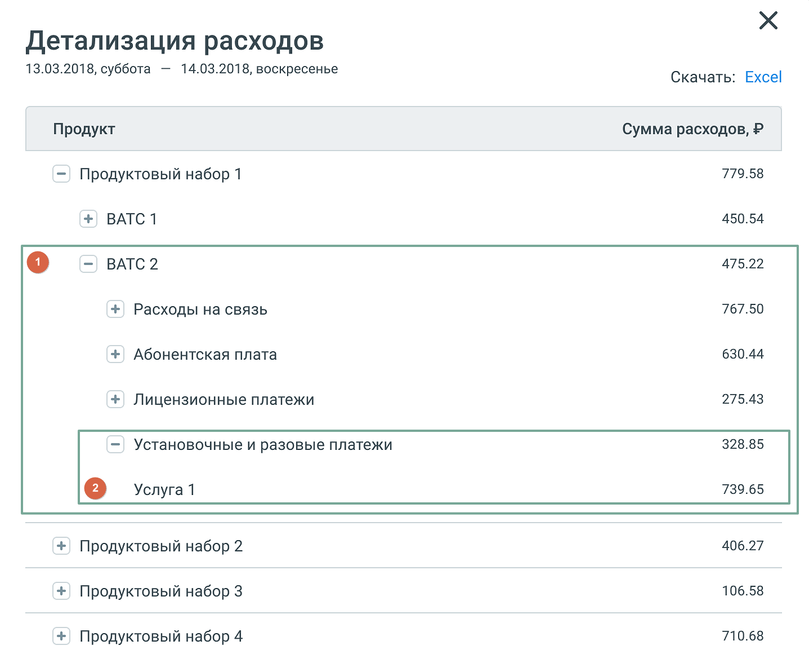
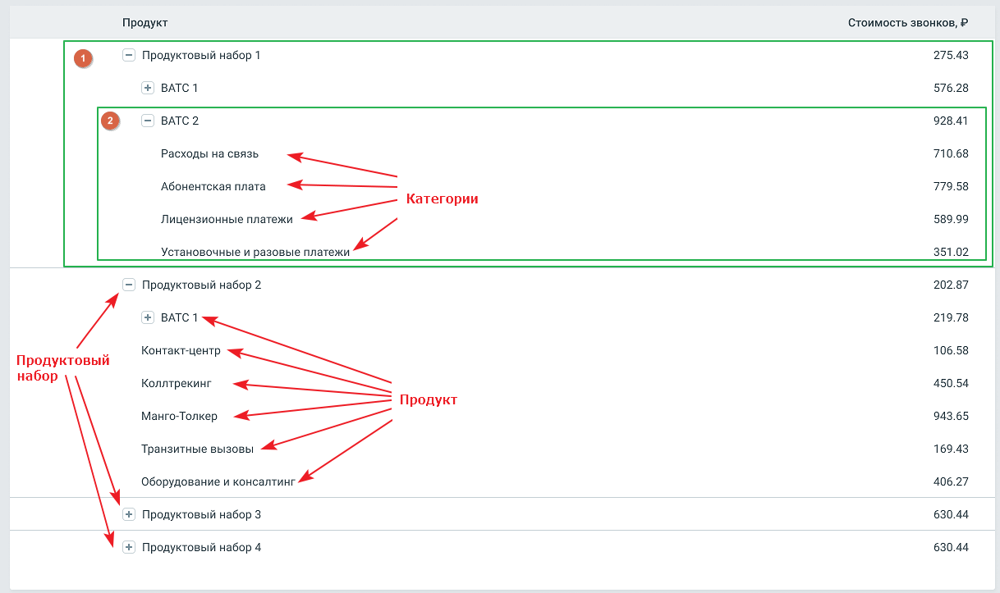

# 2.9. Расходы на продукт

> Трассировка: PDF §2.9 · сквозные стр. 45-49 · источники: ч.1 `kb/mango-product-docs/sources/mango-lk-manual/LK_manual_v-121часть-1.pdf` с.45-49.

2.9 РАСХОДЫ НА ПРОДУКТ Отчет Расходы на продукт позволяет просмотреть детализацию раходов по выбранному продукту за интересующий период времени. внимание Отчет Расходы на продукты отображается в ЛК только если на ВАТС подключена соответствующая услуга. Отчет состоит из трех элементов: 1) Блок фильтров 2) Гистограмма 3) Таблица детализации Блок фильтров

Рис. 2.9.1 Блок фильтров В блоке доступны для выбора следующие фильтры: Период – период данных, отображаемых в отчете: • быстрый выбор из выпадающего списка: ✓ предыдущий год – с первого по последнее число предыдущего года ✓ текущая неделя – с понедельника текущей недели по настоящее время; ✓ текущий месяц – с первого числа текущего месяца по настоящее время; ✓ текущий квартал – с первого числа текущего квартала по настоящее время; ✓ текущий год – с первого числа текущего год по настоящее время; ✓ произвольный период;

внимание Дату начала отчётного периода нельзя задать ранее, чем дата создания лицевого счёта Группировка – группировка данных в отчете по дням, по месяцам; Продукт - список всех продуктов Личного кабинета пользователя, расходы по которым больше нуля; Услуга - Список всех услуг для выбранных продуктов Личного кабинета пользователя, расходы по которым больше нуля. Нажатие на кнопку Показать формирует гистограмму и таблицу детализации. Нажатие на кнопку Очистить сбрасывает настройки фильтров. Гистограмма

Гистограмма содержит: • по оси X - значения фильтра "Группировка"; • по оси Y - сумму расходов в рублях. При наведении курсора мыши на столбец гистограммы отображается всплывающее окно с описанием периода, списком оказанных услуг и суммой расходов. Двойной клик на столбец гистограммы открывает окно с детализацией расходов.

Клик по пиктограмме разворачивает вложенные элементы отчета, по пиктограмме

- сворачивает.

Рис.2.9.2 Блоки 1 и 2 являются вложенными элементами отчета. Под блоком гистограммы содержится следующая информация: • Расходы на продукты – сумма всех расходов по выбранным продуктам за выбранный период; • Расходы на связь - сумма расходов на связь за выбранный период; • Абонентская плата - сумма расходов на абонентскую плату за выбранный период; • Лицензионные платежи - сумма расходов по лицензионным платежам выбранный период; • Установочные и разовые платежи - сумма расходов по установочным и разовым платежам за выбранный период; • Прочие услуги - сумма расходов по прочим услугам на ВАТС за выбранный период.

Клик на кнопку "Excel" открывает стандартное окно экспорта таблицы детализации в формате CSV (Excel). Таблица детализации Таблица содержит детализацию расходов по каждому продуктовому набору ВАТС. Категории "Расходы на связь", "Абонентская плата", "Лицензионные платежи", "Установочные и разовые платежи" и "Прочие услуги" - представлены для каждого продукта ВАТС.

Рис. 2.9.3 Блоки 1 и 2 являются вложенными элементами таблицы детализации. Таблица содержит детализацию данных, отсортированную согласно иерархии. Клик по

пиктограмме разворачивает вложенные элементы таблицы, по пиктограмме - сворачивает. Двойной клик на на продукт или категорию открывает окно с детализацией расходов, аналогичное всплывающему окну в блоке гистограммы.

