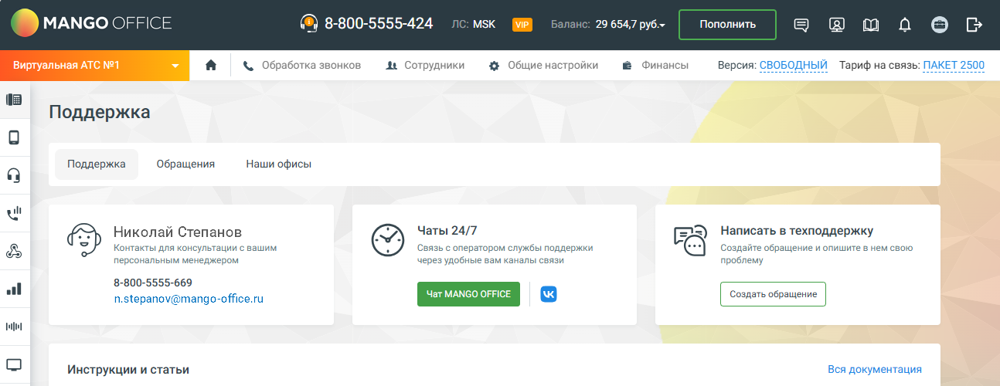

# 3.1. Вкладка «Поддержка»

> Трассировка: PDF §3.1 · сквозные стр. 49 · источники: ч.1 `kb/mango-product-docs/sources/mango-lk-manual/LK_manual_v-121часть-1.pdf` с.49.

На странице «Поддержка» представлены все возможности для связи со специалистами круглосуточной технической поддержки «Манго Телеком» и получения информации о работе продуктов компании. Раздел Поддержка позволяет сотрудникам компании централизованно взаимодействовать с технической поддержкой MANGO OFFICE. Здесь вы можете создавать обращения, просматривать историю взаимодействий, отслеживать статус обработки запросов и использовать быстрые каналы связи (чат, Telegram, VK). Раздел объединяет обращения из всех каналов (личный кабинет, телефон, email, мессенджеры и др.) в едином интерфейсе. Раздел «Поддержка» состоит из трёх вкладок: • Поддержка — быстрые инструменты связи, создание обращения, доступ к документации. • Обращения — список всех обращений вашей организации с фильтрацией и доступом к карточкам. • Наши офисы — адреса, контактные данные и карта расположения офисов. 3.1 ВКЛАДКА «ПОДДЕРЖКА»

