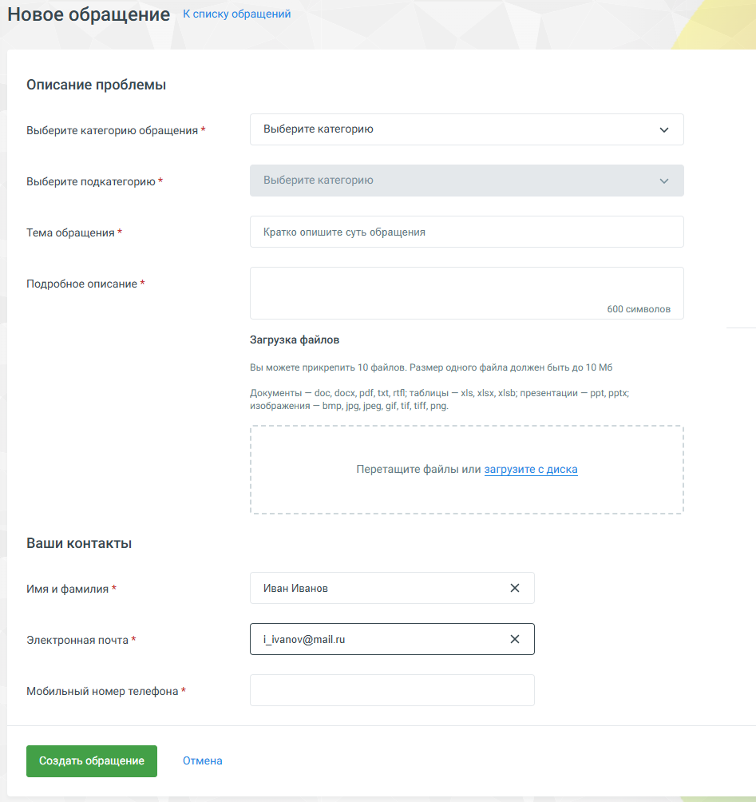

# 3.1.3. Написать в техподдержку

> Трассировка: PDF §3.1.3 · сквозные стр. 50-52 · источники: ч.1 `kb/mango-product-docs/sources/mango-lk-manual/LK_manual_v-121часть-1.pdf` с.50-52.

Кнопка Создать обращение открывает форму, в которой пользователь может указать: • Тему обращения • Категорию и подкатегорию обращения • Описание проблемы • Прикрепить файлы (до 10 штук) • Контактную информацию

По умолчанию в качестве контактного лица указывается пользователь, осуществивший вход в Личный кабинет под своей учетной записью. Поля для ввода контактных данных заполняются автоматически на основании данных, указанных в карточке сотрудника (при их наличии).

Для выбора другого контактного лица следует кликнуть по пиктограмме и выбрать из выпадающего списка требуемое контактное лицо. При вводе части имени и/или фамилии сотрудника ВАТС на экране отображается список по совпадениям. При выборе сотрудника ВАТС поля для ввода контактных данных заполняются автоматически на основании данных, указанных в карточке сотрудника (при их наличии).

Чтобы прикрепить к заявке один или несколько файлов нажмите Прикрепить файл и укажите путь к файлу. Допускается одновременная отправка не более пяти файлов размером не более 10 МБ каждый. Нажмите кнопку Создать обращение. На странице отобразится блок подтверждения с номером созданного обращения, который предназначен для отслеживания его статуса. В блоке отражается диалог со службой тех.поддержки, с указанием номера и статуса обращения. Также в блоке размещаются присоединенные к обращению файлы. После закрытия обращения в разделе появляется функционал оценки пользователем качества предоставленного обслуживания.
