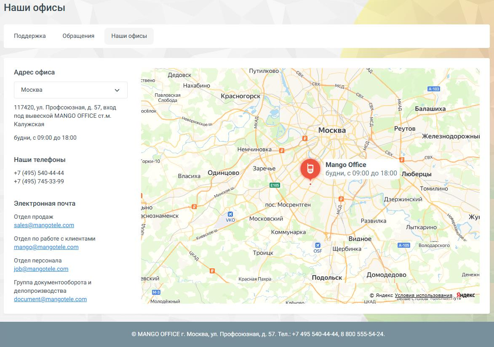

# 3.3. Вкладка «Наши офисы»

> Трассировка: PDF §3.3 · сквозные стр. 54-55 · источники: ч.1 `kb/mango-product-docs/sources/mango-lk-manual/LK_manual_v-121часть-1.pdf` с.54-55.

3.3 ВКЛАДКА «НАШИ ОФИСЫ»

Позволяет быстро получить информацию об адресах и контактах офиса: • Выпадающий список для выбора города • Адрес с временем работы • Телефоны • Email-адреса по отделам: продажи, клиентский отдел, HR, документооборот • Интерактивная карта от Яндекс Удобно для посещения, звонков, отправки документов.

