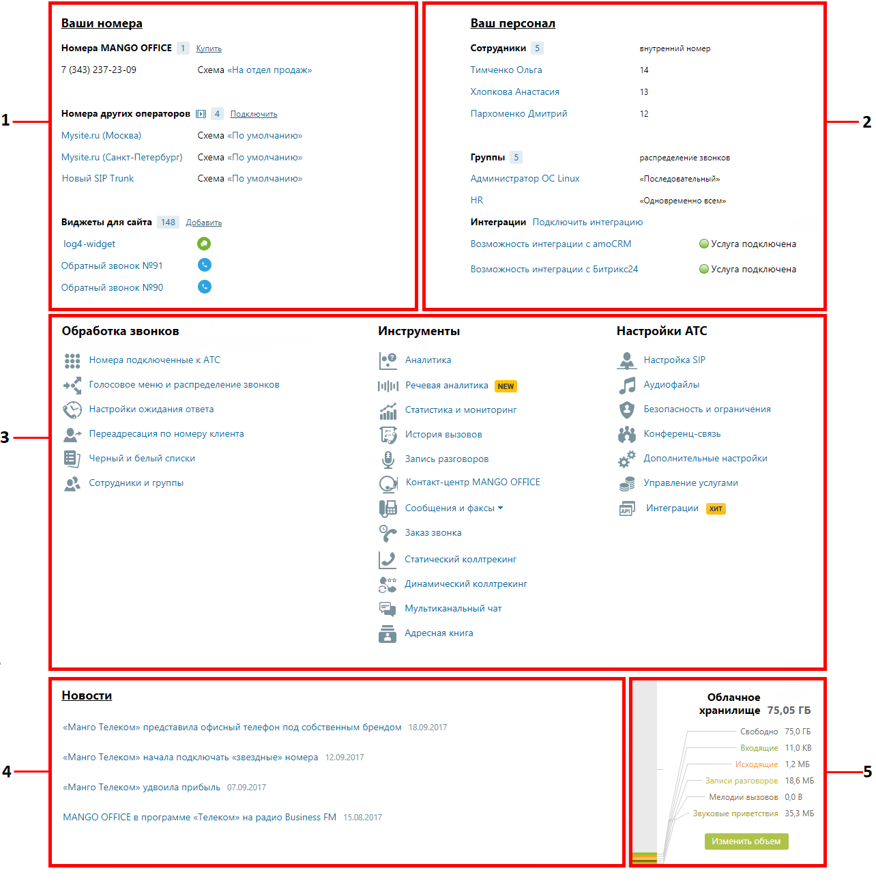

# 4. Продукт «Виртуальная АТС»

> Трассировка: PDF §4 · сквозные стр. 55-57 · источники: ч.1 `kb/mango-product-docs/sources/mango-lk-manual/LK_manual_v-121часть-1.pdf` с.55-57.

Пример внешнего вида страницы продукта Виртуальной АТС представлен на рисунке ниже.

1. Блок «Ваши номера» 2. Блок «Персонал» 3. Блок «Функционал ВАТС»: • Обработка звонков • Инструменты • Настройка АТС 4. Блок «Новости» 5. Блок «Облачное хранилище»

Для возврата к интерфейсу пользовательского рабочего стола следует щелкнуть по

кнопке Главная. Описание интерфейса приведено в разделе Главная страница пользователя. 1. Блок «Ваши номера» Список номеров (способов связи), относящихся к выбранной Виртуальной АТС. Позволяет настраивать новые номера, редактировать и удалять имеющиеся. 2. Блок «Персонал» Блок содержит: • список последних добавленных профилей пользователей для сотрудников и групп пользователей, объединенных для перенаправления звонков; • ссылки для быстрого перехода к страницам «Список сотрудников» и «Группы обзвона»; • список подключенных сторонних систем. 3. Функционал ВАТС Это своего рода пульт управления вашей Виртуальной АТС. 4. Блок «Новости» Информация о последних изменениях в продуктах MANGO OFFICE и свежие предложения нашей компании. 5. Облачное хранилище Информация о свободном и занятом объеме в персональном облачном хранилище данных (сообщения, записи разговоров, аудиофайлы). Названия, выделенные цветом, являются ссылками на соответствующие разделы Личного кабинета.

