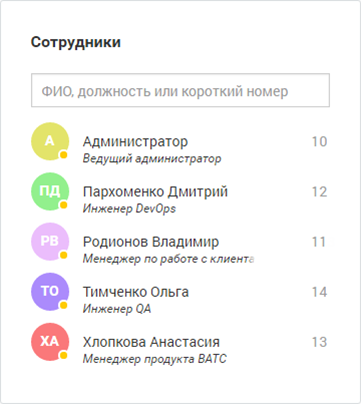
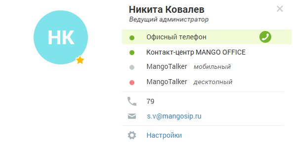

# Виджет «Сотрудники»

> Трассировка: PDF §4 · сквозные стр. 61-62 · источники: ч.1 `kb/mango-product-docs/sources/mango-lk-manual/LK_manual_v-121часть-1.pdf` с.61-62.

Виджет представляет список всех сотрудников, созданных в текущей ВАТС на момент просмотра виджета.

Каждая запись списка отображает следующие сведения о сотруднике: • Аватар с индикатором доступности; • ФИО сотрудника; • Должность; • Внутренний номер. В верхней области виджета предусмотрено поле для поиска сотрудника по ФИО, должности либо короткому номеру. Фильтрация списка выполняется по мере ввода символов. Внимание Функционал добавления сотрудников в список избранных доступен только при входе в Личный кабинет от имени сотрудника. При щелчке по ФИО сотрудника отображается упрощенная персональная карточка сотрудника, содержащая сведения о коммуникациях.

Для выбора аватара щелкните по пиктограмме фотоаппарата и выберите файл с изображением. Далее при необходимости выберите нужный масштаб и отцентрируйте изображение. Список коммуникаций включает: Офисный телефон — учетные записи пользователя, указанные в качестве средств приема звонков. Для каждого из средств приема указывается его статус; Контакт-центр — отображается в случае наличия связанного с ВАТС продукта Контакт- центр. Отражает статус сотрудника Контакт-центра; MangoTalker мобильный — статус пользователя в мобильной версии приложения MangoTalker. При отсутствии установленного приложения указывается «Не найден»; MangoTalker десктопный — статус пользователя в десктопной версии приложения MangoTalker. При отсутствии установленного приложения указывается «Не найден»; Короткий номер — отображается при наличии номера, указанного в поле «Внутренний номер» в карточке сотрудника. Телефон — отображается при наличии в списке средств приема звонков хотя бы одного телефонного номера; Е-mail — отображается при наличии указанного E-mail в карточке сотрудника. При нажатии на адрес выполняется запуск почтового клиента по умолчанию.
