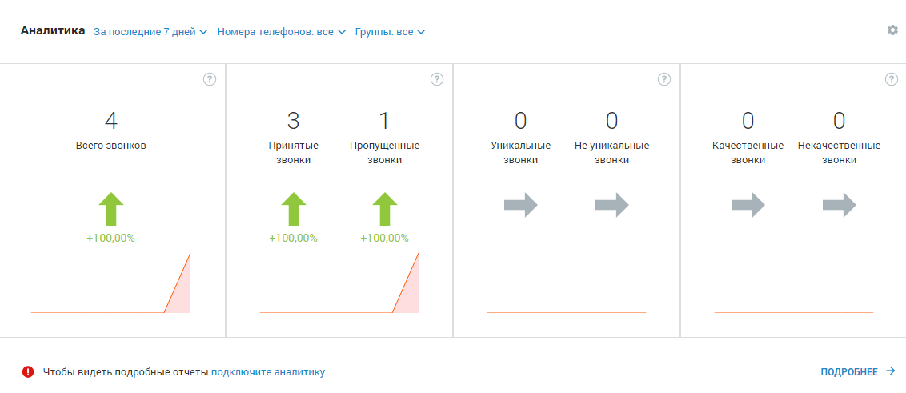

# Виджет «Аналитика»

> Трассировка: PDF §4 · сквозные стр. 64-67 · источники: ч.1 `kb/mango-product-docs/sources/mango-lk-manual/LK_manual_v-121часть-1.pdf` с.64-67.

Виджет «Аналитика» представляет собой отчет, содержащий краткую аналитическую информацию о поступивших вызовах в соответствии с заданными параметрами фильтрации.

Внимание Виджет отображается для сотрудников с ролями «Руководитель компании» и «Маркетолог», а также для сотрудников с ролями, созданных на основе этих ролей. Виджет отображается только на продуктах с тарифными планами с подключенной либо с доступной для подключения услугой «Аналитика». Отчет формируется автоматически при входе на рабочий стол пользователя. Для построения отчетов предусмотрены следующие фильтры: 1. Период отчета: 7 дней, 28 дней. Текущий день в отчет не включается; 2. Номера телефонов. Для этого в форме выбора номеров в списке в левой части окна следует щелкнуть по нужным номерам либо установить флаг «Выбрать все» для выбора всех номеров, после чего нажать Добавить в фильтр;

3. Группа сотрудников. Для этого в форме выбора групп в списке в левой части окна следует щелкнуть по нужным группам, после чего нажать Добавить в фильтр;

Внимание Данный фильтр отображается только при подключенной группе отчетов «Продажи» - платно либо в демо режиме. Отчет будет сформирован автоматически по завершению работы фильтров. Отчет включает четыре области, отображающие данные в соответствии с выбранными фильтрами: • Общее количество входящих звонков (принятых и пропущенных); • Общее количество принятых и пропущенных звонков; • Общее количество исходящих уникальных и не уникальных звонков; • Общее количество исходящих качественных и некачественных звонков. Качественным звонком считается принятый вызов с определенной длительностью, указываемой в отчете «Качественные звонки» инструмента «Аналитика». совет Более подробная информация по звонкам доступна при использовании инструмента «Аналитика». Стрелки отчетов указывают на изменение количества звонков по сравнению с аналогичным предшествующим периодом: • Зеленая – восходящий тренд, количество звонков увеличилось; • Красная – нисходящий тренд, количество звонков уменьшилось;

• Серая – количество звонков не изменилось. При наведении на стрелку отображается соответствующая подсказка. При щелчке по стрелке либо числовому показателю в зависимости от выбранного отчета выполняется переход на страницу: • Отчет «Всего звонков» – переход на страницу отчета «Продажи» - «Пропущенные звонки»; • Отчет «Принятые и пропущенные звонки» – переход на страницу отчета «Продажи» - «Пропущенные звонки»; • Отчет «Уникальные и не уникальные звонки» – переход на страницу отчета «Продажи» - «Качественные звонки»; • Отчет «Качественные и некачественные звонки» – переход на страницу отчета «Продажи» - «Качественные звонки». В нижней части каждого отчета содержится графическое отображение динамики изменений количества звонков в течение выбранного периода. При наведении курсора на график отображается подсказка, включающая дату и количество звонков в указанный день.

Для того, чтобы скрыть виджет, следует щелкнуть по кнопке и выбрать пункт меню «Скрыть виджет».
